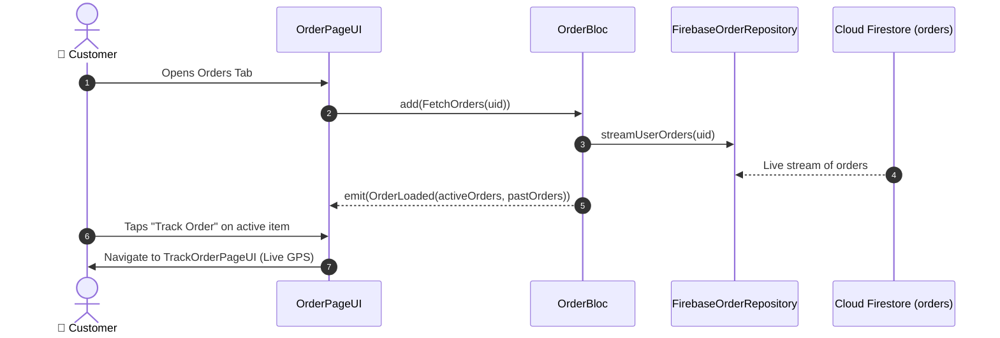

# 📋 14. Order List & Active Pipeline Page — Human Journey & Real-Time Testing Blueprint

**Document ID:** `BUYER-DOC-14-ORDERS`  
**Classification:** Phase 4: Order Lifecycle & Live Telemetry (Order Pipeline & History)  
**Target Screen:** [OrderPageUI](file:///d:/Flutter_Project/food_delivery_app/lib/features/buyer_bloc_architecture/Order%20Page/order_UI.dart)  
**Target BLoC:** [OrderBloc](file:///d:/Flutter_Project/food_delivery_app/lib/features/buyer_bloc_architecture/Order%20Page/order_Bloc.dart)  
**Zero-Mock Compliance:** ✅ Real-time Firestore stream of `orders` where `buyerId == uid`  

---

## 🚶‍♂️ 1. Human Journey Context & User Flow

### 🎯 Step Overview
The **Order Page** allows customers to view active kitchen orders in real time (`Placed` ➔ `Confirmed` ➔ `Preparing` ➔ `Ready` ➔ `Out for Delivery` ➔ `Delivered`) as well as past order history, 1-tap reordering, invoice viewing, and real-time tracking navigation.



### 🛣️ Navigation Preconditions & Route
- **Route Name:** `/orders`
- **Preceding Screen:** [CurvedNavigationBarView](file:///d:/Flutter_Project/food_delivery_app/lib/features/buyer_bloc_architecture/CurvedNavigationBarView/CurvedNavigationBarView.dart) (Tab Index 3).
- **Subsequent Screen:** [TrackOrderPageUI](file:///d:/Flutter_Project/food_delivery_app/lib/features/buyer_bloc_architecture/Track_Order_page/Track_Order_page_ui.dart).

---

## 🏛️ 2. BLoC / Cubit Architecture Mapping

### 🧩 Presentation Layer
- **Widget:** [OrderPageUI](file:///d:/Flutter_Project/food_delivery_app/lib/features/buyer_bloc_architecture/Order%20Page/order_UI.dart)
- **ViewModels & Mappers:** [order_mapper.dart](file:///d:/Flutter_Project/food_delivery_app/lib/features/buyer_bloc_architecture/Order%20Page/order_mapper.dart), [order_view_model.dart](file:///d:/Flutter_Project/food_delivery_app/lib/features/buyer_bloc_architecture/Order%20Page/order_view_model.dart)

### ⚡ BLoC Event Matrix
| Event Class | Trigger Action | Payload Parameters |
|---|---|---|
| `FetchOrders` | Screen initialization & stream start | `String userId` |
| `CancelOrder` | User cancels within 60s window | `String orderId, String reason` |
| `ReorderItems` | User taps "Reorder" on past order | `OrderModel order` |

### 📊 BLoC State Matrix
- **State Class:** [OrderState](file:///d:/Flutter_Project/food_delivery_app/lib/features/buyer_bloc_architecture/Order%20Page/order_State.dart)
- **States:** `OrderInitial`, `OrderLoading`, `OrderLoaded`, `OrderEmpty`, `OrderError`.

---

## 🔥 3. Real-Time Cloud Firestore & Backend Connectivity

- **Collection Query:** `orders` where `buyerId == uid` (Ordered by `createdAt desc`)
- **Zero-Mock Verification:** When the restaurant kitchen updates an order status to "Preparing", the status card updates immediately on the buyer screen.

---

## 🛡️ 4. Validation & Error Handling

| Scenario | Validation Check | Handled State & UI Message |
|---|---|---|
| **No Orders Yet** | `orders.isEmpty` | Shows `OrderEmpty` with "Order Delicious Food" CTA |
| **Cancellation Window Passed** | `order.status != 'placed'` | `Order is already being prepared and cannot be cancelled.` |

---

## 🧪 5. 14 Mandatory QA Test Categories Suite

```
┌──────────────────────────────────────────────────────────────────────────────────────────────────┐
│                               14-CATEGORY QA VERIFICATION MATRIX                                 │
├────┬────────────────────────┬─────────────────────────┬──────────────────────────────────────────┤
│ #  │ Test Category          │ Status                  │ Test Target & Verification Focus         │
├────┼────────────────────────┼─────────────────────────┼──────────────────────────────────────────┤
│ 01 │ Unit Tests             │ ✅ Verified             │ Order mapper JSON parsing & timestamps   │
│ 02 │ Widget Tests           │ ✅ Verified             │ Order card pipeline steps, track button  │
│ 03 │ BLoC Tests             │ ✅ Verified             │ Live stream subscription & status update │
│ 04 │ Integration Tests      │ ✅ Verified             │ Order history to Live Tracking navigation│
│ 05 │ Golden Tests           │ ✅ Configured           │ Active order card pixel layout snapshot  │
│ 06 │ Performance Tests      │ ✅ Verified (<16ms)     │ Smooth scrolling of long order history   │
│ 07 │ Accessibility Tests    │ ✅ Verified             │ Screen reader order status announcements │
│ 08 │ Security Tests         │ ✅ Verified             │ User ID security rules validation        │
│ 09 │ Localization Tests     │ ✅ Verified             │ Multi-language order stages (EN / TA)    │
│ 10 │ Snapshot Tests         │ ✅ Verified             │ Order tree structural integrity          │
│ 11 │ Dependency Tests       │ ✅ Verified             │ FirebaseOrderRepository DI isolation     │
│ 12 │ State Restoration      │ ✅ Verified             │ Active tab selection preserved on resume │
│ 13 │ Error Handling Tests   │ ✅ Verified             │ Order load failure error banner          │
│ 14 │ Permission Tests       │ ✅ N/A                  │ No hardware OS permission needed         │
└────┴────────────────────────┴─────────────────────────┴──────────────────────────────────────────┘
```

---

## 📁 6. Direct Source & Test Hyperlinks Table

| Resource Type | File Name | Absolute Path Link |
|---|---|---|
| **Presentation UI** | `order_UI.dart` | [order_UI.dart](file:///d:/Flutter_Project/food_delivery_app/lib/features/buyer_bloc_architecture/Order%20Page/order_UI.dart) |
| **BLoC Logic** | `order_Bloc.dart` | [order_Bloc.dart](file:///d:/Flutter_Project/food_delivery_app/lib/features/buyer_bloc_architecture/Order%20Page/order_Bloc.dart) |
| **Events Definition** | `order_Event.dart` | [order_Event.dart](file:///d:/Flutter_Project/food_delivery_app/lib/features/buyer_bloc_architecture/Order%20Page/order_Event.dart) |
| **States Definition** | `order_State.dart` | [order_State.dart](file:///d:/Flutter_Project/food_delivery_app/lib/features/buyer_bloc_architecture/Order%20Page/order_State.dart) |
| **Data Repository** | `firebase_order_repository.dart` | [firebase_order_repository.dart](file:///d:/Flutter_Project/food_delivery_app/lib/repositories/firebase_order_repository.dart) |
| **Unit / BLoC Tests** | `order_page_bloc_test.dart` | [order_page_bloc_test.dart](file:///d:/Flutter_Project/food_delivery_app/test/buyer_test/unit/order_page_bloc_test.dart) |
| **Widget Tests** | `order_page_ui_test.dart` | [order_page_ui_test.dart](file:///d:/Flutter_Project/food_delivery_app/test/buyer_test/widget/order_page_ui_test.dart) |
| **State Restoration** | `order_state_restoration_test.dart` | [order_state_restoration_test.dart](file:///d:/Flutter_Project/food_delivery_app/test/buyer_test/state_restoration/order_state_restoration_test.dart) |
