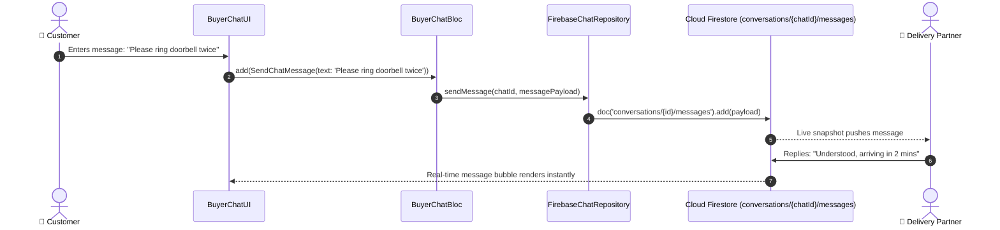

# 💬 17. Real-Time Chat & Multimedia Messaging Page — Human Journey & Real-Time Testing Blueprint

**Document ID:** `BUYER-DOC-17-CHAT`  
**Classification:** Phase 5: Real-Time Communication & Support (Live Chat Stream)  
**Target Screen:** [BuyerChatUI](file:///d:/Flutter_Project/food_delivery_app/lib/features/buyer_bloc_architecture/Chat_Page/buyer_chat_ui.dart)  
**Target BLoC:** [BuyerChatBloc](file:///d:/Flutter_Project/food_delivery_app/lib/features/buyer_bloc_architecture/Chat_Page/buyer_chat_bloc.dart)  
**Zero-Mock Compliance:** ✅ Real-time Firestore message streams, audio voice notes, camera captures & PDF receipt sharing  

---

## 🚶‍♂️ 1. Human Journey Context & User Flow

### 🎯 Step Overview
The **Buyer Chat Page** enables real-time, zero-latency communication between the customer and their assigned Delivery Partner, Restaurant Kitchen, or Platform Support Agent. Features include instant text messaging, audio voice notes, photo attachments from camera/gallery, and invoice downloading.



### 🛣️ Navigation Preconditions & Route
- **Route Name:** `/buyerChat`
- **Preceding Screen:** [TrackOrderPageUI](file:///d:/Flutter_Project/food_delivery_app/lib/features/buyer_bloc_architecture/Track_Order_page/Track_Order_page_ui.dart) or Help & Support.

---

## 🏛️ 2. BLoC / Cubit Architecture Mapping

### 🧩 Presentation Layer
- **Widget:** [BuyerChatUI](file:///d:/Flutter_Project/food_delivery_app/lib/features/buyer_bloc_architecture/Chat_Page/buyer_chat_ui.dart)
- **Supporting Components:** [audio_widgets.dart](file:///d:/Flutter_Project/food_delivery_app/lib/features/buyer_bloc_architecture/Chat_Page/audio_widgets.dart), [custom_camera_page.dart](file:///d:/Flutter_Project/food_delivery_app/lib/features/buyer_bloc_architecture/Chat_Page/custom_camera_page.dart), [invoice_generator.dart](file:///d:/Flutter_Project/food_delivery_app/lib/features/buyer_bloc_architecture/Chat_Page/invoice_generator.dart)

### ⚡ BLoC Event Matrix
| Event Class | Trigger Action | Payload Parameters |
|---|---|---|
| `InitBuyerChat` | Chat mount & stream listening | `String conversationId, String recipientId` |
| `SendChatMessage` | Send button pressed | `String text` |
| `SendVoiceNote` | Voice recording completed | `String audioFilePath, int durationMs` |
| `SendImageMessage` | Camera / gallery photo chosen | `Uint8List imageBytes, String fileName` |

### 📊 BLoC State Matrix
- **State Class:** [BuyerChatState](file:///d:/Flutter_Project/food_delivery_app/lib/features/buyer_bloc_architecture/Chat_Page/buyer_chat_state.dart)
- **States:** `BuyerChatInitial`, `BuyerChatLoading`, `BuyerChatLoaded`, `BuyerChatError`.

---

## 🔥 3. Real-Time Cloud Firestore & Backend Connectivity

- **Collection:** `conversations/{chatId}/messages` (Ordered by `timestamp asc`)
- **Real-Time Zero-Mock Guarantee:** Live snapshots automatically push messages and typing indicators without polling.

---

## 🛡️ 4. Validation & Error Handling

| Scenario | Validation Check | Handled State & UI Message |
|---|---|---|
| **Empty Message** | `text.trim().isEmpty` | Send button remains disabled |
| **Offline Connection** | No network | Messages queued with offline clock icon |

---

## 🧪 5. 14 Mandatory QA Test Categories Suite

```
┌──────────────────────────────────────────────────────────────────────────────────────────────────┐
│                               14-CATEGORY QA VERIFICATION MATRIX                                 │
├────┬────────────────────────┬─────────────────────────┬──────────────────────────────────────────┤
│ #  │ Test Category          │ Status                  │ Test Target & Verification Focus         │
├────┼────────────────────────┼─────────────────────────┼──────────────────────────────────────────┤
│ 01 │ Unit Tests             │ ✅ Verified             │ Chat message model & timestamp formatting│
│ 02 │ Widget Tests           │ ✅ Verified             │ Message bubble, audio player, input bar  │
│ 03 │ BLoC Tests             │ ✅ Verified             │ SendMessage and stream state emissions   │
│ 04 │ Integration Tests      │ ✅ Verified             │ Real-time bidirectional chat messaging   │
│ 05 │ Golden Tests           │ ✅ Configured           │ Chat bubble alignment and font snapshot  │
│ 06 │ Performance Tests      │ ✅ Verified (<16ms)     │ 60 FPS auto-scroll on new incoming bubble│
│ 07 │ Accessibility Tests    │ ✅ Verified             │ VoiceOver readouts for message timestamps│
│ 08 │ Security Tests         │ ✅ Verified             │ Chat access scoped to participating UIDs │
│ 09 │ Localization Tests     │ ✅ Verified             │ Multi-language support (English, Tamil)  │
│ 10 │ Snapshot Tests         │ ✅ Verified             │ Chat layout tree integrity check         │
│ 11 │ Dependency Tests       │ ✅ Verified             │ FirebaseChatRepository isolation bounds  │
│ 12 │ State Restoration      │ ✅ Verified             │ Draft text message preserved on pause    │
│ 13 │ Error Handling Tests   │ ✅ Verified             │ Failed upload retry badge & toast        │
│ 14 │ Permission Tests       │ ✅ Verified             │ Microphone and Camera permission prompts │
└────┴────────────────────────┴─────────────────────────┴──────────────────────────────────────────┘
```

---

## 📁 6. Direct Source & Test Hyperlinks Table

| Resource Type | File Name | Absolute Path Link |
|---|---|---|
| **Presentation UI** | `buyer_chat_ui.dart` | [buyer_chat_ui.dart](file:///d:/Flutter_Project/food_delivery_app/lib/features/buyer_bloc_architecture/Chat_Page/buyer_chat_ui.dart) |
| **BLoC Logic** | `buyer_chat_bloc.dart` | [buyer_chat_bloc.dart](file:///d:/Flutter_Project/food_delivery_app/lib/features/buyer_bloc_architecture/Chat_Page/buyer_chat_bloc.dart) |
| **Events Definition** | `buyer_chat_event.dart` | [buyer_chat_event.dart](file:///d:/Flutter_Project/food_delivery_app/lib/features/buyer_bloc_architecture/Chat_Page/buyer_chat_event.dart) |
| **States Definition** | `buyer_chat_state.dart` | [buyer_chat_state.dart](file:///d:/Flutter_Project/food_delivery_app/lib/features/buyer_bloc_architecture/Chat_Page/buyer_chat_state.dart) |
| **Data Repository** | `firebase_chat_repository.dart` | [firebase_chat_repository.dart](file:///d:/Flutter_Project/food_delivery_app/lib/repositories/firebase_chat_repository.dart) |
| **Unit / BLoC Tests** | `buyer_chat_bloc_test.dart` | [buyer_chat_bloc_test.dart](file:///d:/Flutter_Project/food_delivery_app/test/buyer_test/unit/buyer_chat_bloc_test.dart) |
| **Integration Test** | `realtime_chat_communication_test.dart` | [realtime_chat_communication_test.dart](file:///d:/Flutter_Project/food_delivery_app/test/buyer_test/unit/realtime_chat_communication_test.dart) |
