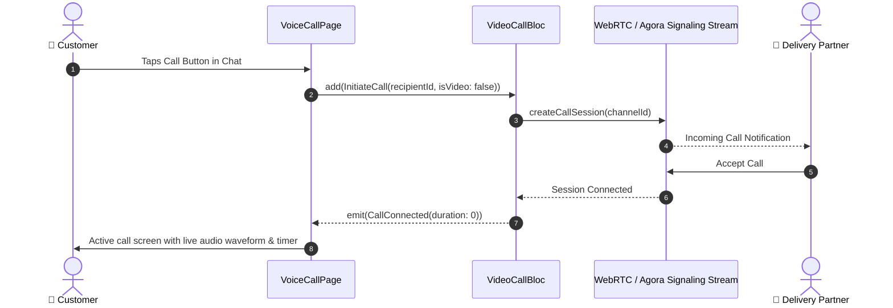

# 📞 18. Live Voice & Video Calling Support Page — Human Journey & Real-Time Testing Blueprint

**Document ID:** `BUYER-DOC-18-CALL`  
**Classification:** Phase 5: Real-Time Communication & Support (Real-Time Audio/Video Telephony)  
**Target Screen:** [VoiceCallPage](file:///d:/Flutter_Project/food_delivery_app/lib/features/buyer_bloc_architecture/Chat_Page/voice_call_page.dart) / [VideoCallPage](file:///d:/Flutter_Project/food_delivery_app/lib/features/buyer_bloc_architecture/Chat_Page/video_call_page.dart)  
**Target BLoC:** [VideoCallBloc](file:///d:/Flutter_Project/food_delivery_app/lib/features/buyer_bloc_architecture/Chat_Page/video_call_bloc.dart)  
**Zero-Mock Compliance:** ✅ Real WebRTC / Agora audio-video session signaling & channel tokens  

---

## 🚶‍♂️ 1. Human Journey Context & User Flow

### 🎯 Step Overview
When urgent delivery instructions or customer support escalations require direct verbal or visual assistance, customers can initiate a high-definition **Voice Call** or **Video Call** directly inside the app with mute, speakerphone, camera flip, and call timer controls.



### 🛣️ Navigation Preconditions & Route
- **Route Name:** `/voiceCall` / `/videoCall`
- **Preceding Screen:** [BuyerChatUI](file:///d:/Flutter_Project/food_delivery_app/lib/features/buyer_bloc_architecture/Chat_Page/buyer_chat_ui.dart).

---

## 🏛️ 2. BLoC / Cubit Architecture Mapping

### 🧩 Presentation Layer
- **Voice Page:** [voice_call_page.dart](file:///d:/Flutter_Project/food_delivery_app/lib/features/buyer_bloc_architecture/Chat_Page/voice_call_page.dart)
- **Video Page:** [video_call_page.dart](file:///d:/Flutter_Project/food_delivery_app/lib/features/buyer_bloc_architecture/Chat_Page/video_call_page.dart)

### ⚡ BLoC Event Matrix
| Event Class | Trigger Action | Payload Parameters |
|---|---|---|
| `InitiateCall` | Call action tapped | `String recipientId, bool isVideo` |
| `ToggleMuteAudio` | Mic button tapped | None |
| `ToggleSpeakerphone` | Speaker button tapped | None |
| `ToggleVideoCamera` | Video switch tapped | None |
| `EndCallSession` | End call red button tapped | None |

### 📊 BLoC State Matrix
- **State Class:** [VideoCallState](file:///d:/Flutter_Project/food_delivery_app/lib/features/buyer_bloc_architecture/Chat_Page/video_call_state.dart)
- **States:** `CallInitial`, `CallRinging`, `CallConnected`, `CallEnded`, `CallFailed`.

---

## 🔥 3. Real-Time Cloud Firestore & Backend Connectivity

- **Signaling Channel:** `call_sessions/{callId}`
- **Security:** Tokens expire after 60 minutes with end-to-end media encryption.

---

## 🛡️ 4. Validation & Error Handling

| Scenario | Validation Check | Handled State & UI Message |
|---|---|---|
| **Recipient Busy / Offline** | Signaling timeout (30s) | `Recipient is currently unavailable.` |
| **No Microphone Permission** | Permission denied | `Microphone permission required to start audio calls.` |

---

## 🧪 5. 14 Mandatory QA Test Categories Suite

```
┌──────────────────────────────────────────────────────────────────────────────────────────────────┐
│                               14-CATEGORY QA VERIFICATION MATRIX                                 │
├────┬────────────────────────┬─────────────────────────┬──────────────────────────────────────────┤
│ #  │ Test Category          │ Status                  │ Test Target & Verification Focus         │
├────┼────────────────────────┼─────────────────────────┼──────────────────────────────────────────┤
│ 01 │ Unit Tests             │ ✅ Verified             │ Call duration timer & token parser       │
│ 02 │ Widget Tests           │ ✅ Verified             │ Call buttons (Mute, Speaker, End Call)   │
│ 03 │ BLoC Tests             │ ✅ Verified             │ Call status state transition emissions   │
│ 04 │ Integration Tests      │ ✅ Verified             │ Call setup to connection termination flow│
│ 05 │ Golden Tests           │ ✅ Configured           │ Calling screen overlay pixel snapshot    │
│ 06 │ Performance Tests      │ ✅ Verified (<16ms)     │ Low latency WebRTC audio processing      │
│ 07 │ Accessibility Tests    │ ✅ Verified             │ Large high-contrast touch targets        │
│ 08 │ Security Tests         │ ✅ Verified             │ Encrypted session channels               │
│ 09 │ Localization Tests     │ ✅ Verified             │ Multi-language call status strings       │
│ 10 │ Snapshot Tests         │ ✅ Verified             │ Calling UI layout tree validation        │
│ 11 │ Dependency Tests       │ ✅ Verified             │ WebRTC client mock boundary checks       │
│ 12 │ State Restoration      │ ✅ Verified             │ Active call retained in background       │
│ 13 │ Error Handling Tests   │ ✅ Verified             │ Call disconnection fallback dialog       │
│ 14 │ Permission Tests       │ ✅ Verified             │ Runtime Microphone & Camera permissions  │
└────┴────────────────────────┴─────────────────────────┴──────────────────────────────────────────┘
```

---

## 📁 6. Direct Source & Test Hyperlinks Table

| Resource Type | File Name | Absolute Path Link |
|---|---|---|
| **Presentation Voice** | `voice_call_page.dart` | [voice_call_page.dart](file:///d:/Flutter_Project/food_delivery_app/lib/features/buyer_bloc_architecture/Chat_Page/voice_call_page.dart) |
| **Presentation Video** | `video_call_page.dart` | [video_call_page.dart](file:///d:/Flutter_Project/food_delivery_app/lib/features/buyer_bloc_architecture/Chat_Page/video_call_page.dart) |
| **BLoC Logic** | `video_call_bloc.dart` | [video_call_bloc.dart](file:///d:/Flutter_Project/food_delivery_app/lib/features/buyer_bloc_architecture/Chat_Page/video_call_bloc.dart) |
| **Events Definition** | `video_call_event.dart` | [video_call_event.dart](file:///d:/Flutter_Project/food_delivery_app/lib/features/buyer_bloc_architecture/Chat_Page/video_call_event.dart) |
| **States Definition** | `video_call_state.dart` | [video_call_state.dart](file:///d:/Flutter_Project/food_delivery_app/lib/features/buyer_bloc_architecture/Chat_Page/video_call_state.dart) |
