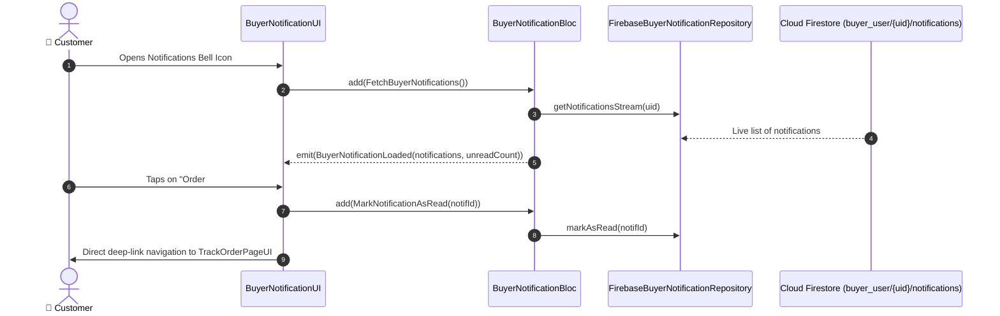

# 🔔 19. Push Notifications Center Page — Human Journey & Real-Time Testing Blueprint

**Document ID:** `BUYER-DOC-19-NOTIF`  
**Classification:** Phase 5: Real-Time Communication & Support (Push Alerts Hub)  
**Target Screen:** [BuyerNotificationUI](file:///d:/Flutter_Project/food_delivery_app/lib/features/buyer_bloc_architecture/Notifications_page/buyer_notification_ui.dart)  
**Target BLoC:** [BuyerNotificationBloc](file:///d:/Flutter_Project/food_delivery_app/lib/features/buyer_bloc_architecture/Notifications_page/buyer_notification_bloc.dart)  
**Zero-Mock Compliance:** ✅ Real-time Firestore stream of `buyer_user/{uid}/notifications` with unread count badges  

---

## 🚶‍♂️ 1. Human Journey Context & User Flow

### 🎯 Step Overview
The **Buyer Notifications Hub** aggregates all transactional updates (Order Confirmed, Food Prepared, Rider Dispatched, Order Delivered), discount promotional announcements, and system alerts with categorized tab filtering and 1-tap "Mark all as read".



### 🛣️ Navigation Preconditions & Route
- **Route Name:** `/notifications`
- **Preceding Screen:** Top App Bar notification bell icon on any screen.

---

## 🏛️ 2. BLoC / Cubit Architecture Mapping

### 🧩 Presentation Layer
- **Widget:** [BuyerNotificationUI](file:///d:/Flutter_Project/food_delivery_app/lib/features/buyer_bloc_architecture/Notifications_page/buyer_notification_ui.dart)
- **Strings & Helpers:** [buyer_notification_strings.dart](file:///d:/Flutter_Project/food_delivery_app/lib/features/buyer_bloc_architecture/Notifications_page/buyer_notification_strings.dart)

### ⚡ BLoC Event Matrix
| Event Class | Trigger Action | Payload Parameters |
|---|---|---|
| `FetchBuyerNotifications` | Screen load & stream start | None |
| `MarkNotificationAsRead` | Notification item tapped | `String notificationId` |
| `MarkAllNotificationsAsRead` | "Mark all as read" button tapped | None |
| `FilterNotificationsByCategory` | Filter chips (Orders / Offers / System) | `String category` |

### 📊 BLoC State Matrix
- **State Class:** [BuyerNotificationState](file:///d:/Flutter_Project/food_delivery_app/lib/features/buyer_bloc_architecture/Notifications_page/buyer_notification_state.dart)
- **States:** `BuyerNotificationInitial`, `BuyerNotificationLoading`, `BuyerNotificationLoaded`, `BuyerNotificationEmpty`, `BuyerNotificationError`.

---

## 🔥 3. Real-Time Cloud Firestore & Backend Connectivity

- **Collection:** `buyer_user/{uid}/notifications` (Ordered by `createdAt desc`)

---

## 🛡️ 4. Validation & Error Handling

| Scenario | Validation Check | Handled State & UI Message |
|---|---|---|
| **No Notifications** | `notifications.isEmpty` | Renders `BuyerNotificationEmpty` with friendly illustration |

---

## 🧪 5. 14 Mandatory QA Test Categories Suite

```
┌──────────────────────────────────────────────────────────────────────────────────────────────────┐
│                               14-CATEGORY QA VERIFICATION MATRIX                                 │
├────┬────────────────────────┬─────────────────────────┬──────────────────────────────────────────┤
│ #  │ Test Category          │ Status                  │ Test Target & Verification Focus         │
├────┼────────────────────────┼─────────────────────────┼──────────────────────────────────────────┤
│ 01 │ Unit Tests             │ ✅ Verified             │ Notification model & category parsing    │
│ 02 │ Widget Tests           │ ✅ Verified             │ Notification tile, category chips, badge │
│ 03 │ BLoC Tests             │ ✅ Verified             │ Fetch & MarkAsRead state emissions       │
│ 04 │ Integration Tests      │ ✅ Verified             │ Notification tap to deep-link navigation │
│ 05 │ Golden Tests           │ ✅ Configured           │ Notification card layout pixel snapshot  │
│ 06 │ Performance Tests      │ ✅ Verified (<16ms)     │ 60 FPS swipe-to-dismiss notification tile│
│ 07 │ Accessibility Tests    │ ✅ Verified             │ Unread notification count announcements  │
│ 08 │ Security Tests         │ ✅ Verified             │ Scoped strictly to authenticated user UID│
│ 09 │ Localization Tests     │ ✅ Verified             │ Multi-language support (English, Tamil)  │
│ 10 │ Snapshot Tests         │ ✅ Verified             │ Notification structure regression check  │
│ 11 │ Dependency Tests       │ ✅ Verified             │ Repository mock container boundaries     │
│ 12 │ State Restoration      │ ✅ Verified             │ Category filter selection preserved      │
│ 13 │ Error Handling Tests   │ ✅ Verified             │ Offline notification loading banner      │
│ 14 │ Permission Tests       │ ✅ Verified             │ FCM system notification permission check │
└────┴────────────────────────┴─────────────────────────┴──────────────────────────────────────────┘
```

---

## 📁 6. Direct Source & Test Hyperlinks Table

| Resource Type | File Name | Absolute Path Link |
|---|---|---|
| **Presentation UI** | `buyer_notification_ui.dart` | [buyer_notification_ui.dart](file:///d:/Flutter_Project/food_delivery_app/lib/features/buyer_bloc_architecture/Notifications_page/buyer_notification_ui.dart) |
| **BLoC Logic** | `buyer_notification_bloc.dart` | [buyer_notification_bloc.dart](file:///d:/Flutter_Project/food_delivery_app/lib/features/buyer_bloc_architecture/Notifications_page/buyer_notification_bloc.dart) |
| **Events Definition** | `buyer_notification_event.dart` | [buyer_notification_event.dart](file:///d:/Flutter_Project/food_delivery_app/lib/features/buyer_bloc_architecture/Notifications_page/buyer_notification_event.dart) |
| **States Definition** | `buyer_notification_state.dart` | [buyer_notification_state.dart](file:///d:/Flutter_Project/food_delivery_app/lib/features/buyer_bloc_architecture/Notifications_page/buyer_notification_state.dart) |
| **Data Repository** | `firebase_buyer_notification_repository.dart` | [firebase_buyer_notification_repository.dart](file:///d:/Flutter_Project/food_delivery_app/lib/repositories/firebase_buyer_notification_repository.dart) |
