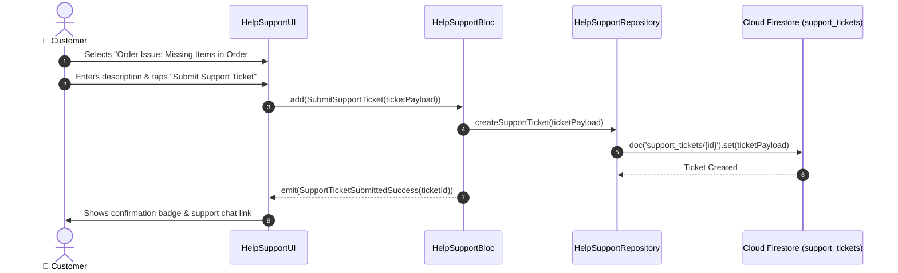

# 🎧 20. Help & Customer Support Page — Human Journey & Real-Time Testing Blueprint

**Document ID:** `BUYER-DOC-20-SUPPORT`  
**Classification:** Phase 5: Real-Time Communication & Support (Helpdesk & Dispute Tickets)  
**Target Screen:** [HelpSupportUI](file:///d:/Flutter_Project/food_delivery_app/lib/features/buyer_bloc_architecture/HelpSupportPage/HelpSupport_UI.dart)  
**Target BLoC:** [HelpSupportBloc](file:///d:/Flutter_Project/food_delivery_app/lib/features/buyer_bloc_architecture/HelpSupportPage/HelpSupport_Bloc.dart)  
**Zero-Mock Compliance:** ✅ Real-time Firestore support ticket submission & FAQ search  

---

## 🚶‍♂️ 1. Human Journey Context & User Flow

### 🎯 Step Overview
The **Help & Support Page** offers customers rapid dispute resolution, frequently asked questions (FAQs) with expandable accordion answers, order-related refund claims, and live customer agent escalation channels.



### 🛣️ Navigation Preconditions & Route
- **Route Name:** `/helpSupport`
- **Preceding Screen:** [UserProfileImageUI](file:///d:/Flutter_Project/food_delivery_app/lib/features/buyer_bloc_architecture/user_profile_image/user_profile_image_UI.dart).

---

## 🏛️ 2. BLoC / Cubit Architecture Mapping

### 🧩 Presentation Layer
- **Widget:** [HelpSupportUI](file:///d:/Flutter_Project/food_delivery_app/lib/features/buyer_bloc_architecture/HelpSupportPage/HelpSupport_UI.dart)

### ⚡ BLoC Event Matrix
| Event Class | Trigger Action | Payload Parameters |
|---|---|---|
| `LoadFaqList` | Page initialization | None |
| `SearchFaqQuery` | Search bar typing | `String query` |
| `SubmitSupportTicket` | User submits ticket form | `Map<String, dynamic> ticketData` |

### 📊 BLoC State Matrix
- **State Class:** [HelpSupportState](file:///d:/Flutter_Project/food_delivery_app/lib/features/buyer_bloc_architecture/HelpSupportPage/HelpSupport_State.dart)
- **States:** `HelpSupportInitial`, `HelpSupportLoading`, `HelpSupportLoaded`, `HelpSupportSuccess`, `HelpSupportError`.

---

## 🔥 3. Real-Time Cloud Firestore & Backend Connectivity

- **Support Tickets Collection:** `support_tickets/{ticketId}`

---

## 🛡️ 4. Validation & Error Handling

| Scenario | Validation Check | Handled State & UI Message |
|---|---|---|
| **Empty Ticket Description** | `description.trim().isEmpty` | `Please describe your issue in detail.` |

---

## 🧪 5. 14 Mandatory QA Test Categories Suite

```
┌──────────────────────────────────────────────────────────────────────────────────────────────────┐
│                               14-CATEGORY QA VERIFICATION MATRIX                                 │
├────┬────────────────────────┬─────────────────────────┬──────────────────────────────────────────┤
│ #  │ Test Category          │ Status                  │ Test Target & Verification Focus         │
├────┼────────────────────────┼─────────────────────────┼──────────────────────────────────────────┤
│ 01 │ Unit Tests             │ ✅ Verified             │ FAQ query matching & ticket serialization│
│ 02 │ Widget Tests           │ ✅ Verified             │ FAQ accordion expand/collapse, form view │
│ 03 │ BLoC Tests             │ ✅ Verified             │ SubmitSupportTicket state stream         │
│ 04 │ Integration Tests      │ ✅ Verified             │ Support ticket creation to confirmation  │
│ 05 │ Golden Tests           │ ✅ Configured           │ Support page pixel snapshot on Mobile    │
│ 06 │ Performance Tests      │ ✅ Verified (<16ms)     │ 60 FPS accordion expansion animation     │
│ 07 │ Accessibility Tests    │ ✅ Verified             │ Semantic accessibility for FAQ items     │
│ 08 │ Security Tests         │ ✅ Verified             │ Input sanitization on dispute textfields │
│ 09 │ Localization Tests     │ ✅ Verified             │ Multi-language support (English, Tamil)  │
│ 10 │ Snapshot Tests         │ ✅ Verified             │ Support layout tree structural integrity │
│ 11 │ Dependency Tests       │ ✅ Verified             │ HelpSupportRepository mock isolation     │
│ 12 │ State Restoration      │ ✅ Verified             │ Ticket draft text preserved on pause     │
│ 13 │ Error Handling Tests   │ ✅ Verified             │ Ticket submission error toast            │
│ 14 │ Permission Tests       │ ✅ N/A                  │ No hardware OS permission needed         │
└────┴────────────────────────┴─────────────────────────┴──────────────────────────────────────────┘
```

---

## 📁 6. Direct Source & Test Hyperlinks Table

| Resource Type | File Name | Absolute Path Link |
|---|---|---|
| **Presentation UI** | `HelpSupport_UI.dart` | [HelpSupport_UI.dart](file:///d:/Flutter_Project/food_delivery_app/lib/features/buyer_bloc_architecture/HelpSupportPage/HelpSupport_UI.dart) |
| **BLoC Logic** | `HelpSupport_Bloc.dart` | [HelpSupport_Bloc.dart](file:///d:/Flutter_Project/food_delivery_app/lib/features/buyer_bloc_architecture/HelpSupportPage/HelpSupport_Bloc.dart) |
| **Events Definition** | `HelpSupport_Event.dart` | [HelpSupport_Event.dart](file:///d:/Flutter_Project/food_delivery_app/lib/features/buyer_bloc_architecture/HelpSupportPage/HelpSupport_Event.dart) |
| **States Definition** | `HelpSupport_State.dart` | [HelpSupport_State.dart](file:///d:/Flutter_Project/food_delivery_app/lib/features/buyer_bloc_architecture/HelpSupportPage/HelpSupport_State.dart) |
| **Data Repository** | `HelpSupport_Repository.dart` | [HelpSupport_Repository.dart](file:///d:/Flutter_Project/food_delivery_app/lib/features/buyer_bloc_architecture/HelpSupportPage/HelpSupport_Repository.dart) |
| **Unit / BLoC Tests** | `help_support_bloc_test.dart` | [help_support_bloc_test.dart](file:///d:/Flutter_Project/food_delivery_app/test/buyer_test/unit/help_support_bloc_test.dart) |
| **Widget Tests** | `help_support_page_widget_test.dart` | [help_support_page_widget_test.dart](file:///d:/Flutter_Project/food_delivery_app/test/buyer_test/widget/help_support_page_widget_test.dart) |
