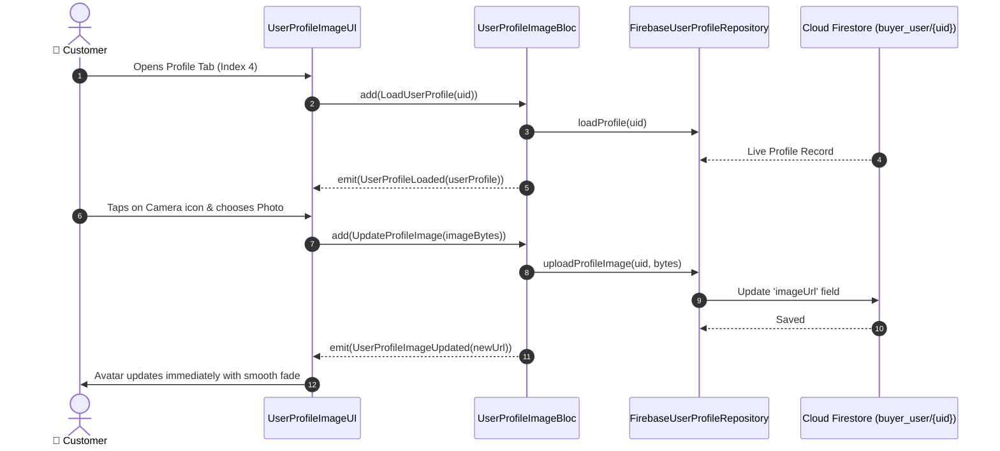

# 👤 21. Buyer Profile & Avatar Page — Human Journey & Real-Time Testing Blueprint

**Document ID:** `BUYER-DOC-21-PROFILE`  
**Classification:** Phase 6: Profile, Addresses & Global Settings (Profile Hub)  
**Target Screen:** [UserProfileImageUI](file:///d:/Flutter_Project/food_delivery_app/lib/features/buyer_bloc_architecture/user_profile_image/user_profile_image_UI.dart)  
**Target BLoC:** [UserProfileImageBloc](file:///d:/Flutter_Project/food_delivery_app/lib/features/buyer_bloc_architecture/user_profile_image/user_profile_image_Bloc.dart)  
**Zero-Mock Compliance:** ✅ Real-time Firestore stream of `buyer_user/{uid}` & Firebase Storage avatar upload  

---

## 🚶‍♂️ 1. Human Journey Context & User Flow

### 🎯 Step Overview
The **Buyer Profile Page** is the central management hub for account information. It showcases the user's avatar, full name, email, phone number, loyalty membership badge, and navigable settings tiles (`Personal Info`, `My Addresses`, `Payment Methods`, `Wallet`, `App Settings`, `Help & Support`, `Logout`).



### 🛣️ Navigation Preconditions & Route
- **Route Name:** `/buyerProfile`
- **Preceding Screen:** [CurvedNavigationBarView](file:///d:/Flutter_Project/food_delivery_app/lib/features/buyer_bloc_architecture/CurvedNavigationBarView/CurvedNavigationBarView.dart) (Tab Index 4).

---

## 🏛️ 2. BLoC / Cubit Architecture Mapping

### 🧩 Presentation Layer
- **Widget:** [UserProfileImageUI](file:///d:/Flutter_Project/food_delivery_app/lib/features/buyer_bloc_architecture/user_profile_image/user_profile_image_UI.dart)
- **Models:** [user_profile_models.dart](file:///d:/Flutter_Project/food_delivery_app/lib/features/buyer_bloc_architecture/user_profile_image/user_profile_models.dart)

### ⚡ BLoC Event Matrix
| Event Class | Trigger Action | Payload Parameters |
|---|---|---|
| `LoadUserProfile` | Profile screen mount | `String userId` |
| `UpdateProfileImage` | Camera / gallery image selected | `Uint8List imageBytes, String fileName` |
| `SaveUserProfileData` | Edit profile form save | `UserProfile profile` |
| `BuyerLogoutRequested` | Logout button tapped | None |

### 📊 BLoC State Matrix
- **State Class:** [UserProfileImageState](file:///d:/Flutter_Project/food_delivery_app/lib/features/buyer_bloc_architecture/user_profile_image/user_profile_image_State.dart)
- **States:** `UserProfileInitial`, `UserProfileLoading`, `UserProfileLoaded`, `UserProfileError`.

---

## 🔥 3. Real-Time Cloud Firestore & Backend Connectivity

- **Collection:** `buyer_user/{uid}`
- **Storage Path:** `user/image/{uid}.jpg`

---

## 🛡️ 4. Validation & Error Handling

| Scenario | Validation Check | Handled State & UI Message |
|---|---|---|
| **Image Upload Exceeds 5MB** | `imageBytes.lengthInBytes > 5 * 1024 * 1024` | `Image file size must be less than 5MB.` |

---

## 🧪 5. 14 Mandatory QA Test Categories Suite

```
┌──────────────────────────────────────────────────────────────────────────────────────────────────┐
│                               14-CATEGORY QA VERIFICATION MATRIX                                 │
├────┬────────────────────────┬─────────────────────────┬──────────────────────────────────────────┤
│ #  │ Test Category          │ Status                  │ Test Target & Verification Focus         │
├────┼────────────────────────┼─────────────────────────┼──────────────────────────────────────────┤
│ 01 │ Unit Tests             │ ✅ Verified             │ UserProfile model JSON serialization     │
│ 02 │ Widget Tests           │ ✅ Verified             │ Profile avatar, action list tiles, logout│
│ 03 │ BLoC Tests             │ ✅ Verified             │ LoadProfile & UpdateImage state emissions│
│ 04 │ Integration Tests      │ ✅ Verified             │ Profile update to Firestore sync pipeline│
│ 05 │ Golden Tests           │ ✅ Configured           │ Profile screen pixel layout snapshot     │
│ 06 │ Performance Tests      │ ✅ Verified (<16ms)     │ Zero UI freeze on image byte compression │
│ 07 │ Accessibility Tests    │ ✅ Verified             │ Accessibility labels on action tiles     │
│ 08 │ Security Tests         │ ✅ Verified             │ Storage upload tokenization & rules      │
│ 09 │ Localization Tests     │ ✅ Verified             │ Multi-language profile copy (EN / TA)    │
│ 10 │ Snapshot Tests         │ ✅ Verified             │ Profile structure hierarchy verification │
│ 11 │ Dependency Tests       │ ✅ Verified             │ Repository & Storage mock boundaries     │
│ 12 │ State Restoration      │ ✅ Verified             │ User profile state preserved on pause    │
│ 13 │ Error Handling Tests   │ ✅ Verified             │ Storage upload network error toast       │
│ 14 │ Permission Tests       │ ✅ Verified             │ Camera & Photo gallery OS permissions    │
└────┴────────────────────────┴─────────────────────────┴──────────────────────────────────────────┘
```

---

## 📁 6. Direct Source & Test Hyperlinks Table

| Resource Type | File Name | Absolute Path Link |
|---|---|---|
| **Presentation UI** | `user_profile_image_UI.dart` | [user_profile_image_UI.dart](file:///d:/Flutter_Project/food_delivery_app/lib/features/buyer_bloc_architecture/user_profile_image/user_profile_image_UI.dart) |
| **BLoC Logic** | `user_profile_image_Bloc.dart` | [user_profile_image_Bloc.dart](file:///d:/Flutter_Project/food_delivery_app/lib/features/buyer_bloc_architecture/user_profile_image/user_profile_image_Bloc.dart) |
| **Events Definition** | `user_profile_image_Event.dart` | [user_profile_image_Event.dart](file:///d:/Flutter_Project/food_delivery_app/lib/features/buyer_bloc_architecture/user_profile_image/user_profile_image_Event.dart) |
| **States Definition** | `user_profile_image_State.dart` | [user_profile_image_State.dart](file:///d:/Flutter_Project/food_delivery_app/lib/features/buyer_bloc_architecture/user_profile_image/user_profile_image_State.dart) |
| **Data Repository** | `firebase_user_profile_repository.dart` | [firebase_user_profile_repository.dart](file:///d:/Flutter_Project/food_delivery_app/lib/repositories/firebase_user_profile_repository.dart) |
| **Unit / BLoC Tests** | `user_profile_image_unit_test.dart` | [user_profile_image_unit_test.dart](file:///d:/Flutter_Project/food_delivery_app/test/buyer_test/unit/user_profile_image_unit_test.dart) |
| **Widget Tests** | `user_profile_image_widget_test.dart` | [user_profile_image_widget_test.dart](file:///d:/Flutter_Project/food_delivery_app/test/buyer_test/widget/user_profile_image_widget_test.dart) |
