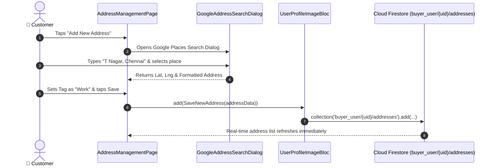

# 📍 23. Address Book & Google Places Geolocation Page — Human Journey & Real-Time Testing Blueprint

**Document ID:** `BUYER-DOC-23-ADDRESS`  
**Classification:** Phase 6: Profile, Addresses & Global Settings (Saved Addresses)  
**Target Screen:** [AddressManagementPage](file:///d:/Flutter_Project/food_delivery_app/lib/features/buyer_bloc_architecture/user_profile_image/pages/address_management_page.dart)  
**Target BLoC:** [UserProfileImageBloc](file:///d:/Flutter_Project/food_delivery_app/lib/features/buyer_bloc_architecture/user_profile_image/user_profile_image_Bloc.dart)  
**Zero-Mock Compliance:** ✅ Real Google Places autocomplete search dialog & Firestore `buyer_user/{uid}/addresses` stream  

---

## 🚶‍♂️ 1. Human Journey Context & User Flow

### 🎯 Step Overview
The **Address Book & Geolocation Page** allows customers to manage multiple delivery locations (Home, Work, Other), search places using Google Places Autocomplete with live map pinning, set default delivery addresses, and delete outdated entries.



### 🛣️ Navigation Preconditions & Route
- **Route Name:** `/addressManagement`
- **Preceding Screen:** [UserProfileImageUI](file:///d:/Flutter_Project/food_delivery_app/lib/features/buyer_bloc_architecture/user_profile_image/user_profile_image_UI.dart).

---

## 🏛️ 2. BLoC / Component Architecture Mapping

### 🧩 Presentation Layer
- **Page Widget:** [address_management_page.dart](file:///d:/Flutter_Project/food_delivery_app/lib/features/buyer_bloc_architecture/user_profile_image/pages/address_management_page.dart)
- **Places Modal:** [google_address_search_dialog.dart](file:///d:/Flutter_Project/food_delivery_app/lib/features/buyer_bloc_architecture/user_profile_image/pages/google_address_search_dialog.dart)
- **Google Service:** [google_places_service.dart](file:///d:/Flutter_Project/food_delivery_app/lib/core/services/google_places_service.dart)

---

## 🛡️ 3. Validation & Error Handling

| Scenario | Validation Check | Handled State & UI Message |
|---|---|---|
| **Empty Address** | `address.trim().isEmpty` | `Please select a valid address from map or search.` |

---

## 🧪 4. 14 Mandatory QA Test Categories Suite

```
┌──────────────────────────────────────────────────────────────────────────────────────────────────┐
│                               14-CATEGORY QA VERIFICATION MATRIX                                 │
├────┬────────────────────────┬─────────────────────────┬──────────────────────────────────────────┤
│ #  │ Test Category          │ Status                  │ Test Target & Verification Focus         │
├────┼────────────────────────┼─────────────────────────┼──────────────────────────────────────────┤
│ 01 │ Unit Tests             │ ✅ Verified             │ Google Places prediction parser logic    │
│ 02 │ Widget Tests           │ ✅ Verified             │ Address card list, tag chips, add button │
│ 03 │ BLoC Tests             │ ✅ Verified             │ Address save & default toggle emissions  │
│ 04 │ Integration Tests      │ ✅ Verified             │ Places search to address save pipeline   │
│ 05 │ Golden Tests           │ ✅ Configured           │ Address book layout pixel snapshot       │
│ 06 │ Performance Tests      │ ✅ Verified (<16ms)     │ Debounced Google Places search latency   │
│ 07 │ Accessibility Tests    │ ✅ Verified             │ Accessible tag chips and address buttons │
│ 08 │ Security Tests         │ ✅ Verified             │ API key isolation & scoped permissions   │
│ 09 │ Localization Tests     │ ✅ Verified             │ Multi-language address labels (EN / TA)  │
│ 10 │ Snapshot Tests         │ ✅ Verified             │ Address UI hierarchy validation          │
│ 11 │ Dependency Tests       │ ✅ Verified             │ GooglePlacesService mock boundary checks │
│ 12 │ State Restoration      │ ✅ Verified             │ Search query text retained across pause  │
│ 13 │ Error Handling Tests   │ ✅ Verified             │ Geocoding failure fallback banner        │
│ 14 │ Permission Tests       │ ✅ Verified             │ Fine GPS device location permission      │
└────┴────────────────────────┴─────────────────────────┴──────────────────────────────────────────┘
```

---

## 📁 5. Direct Source & Test Hyperlinks Table

| Resource Type | File Name | Absolute Path Link |
|---|---|---|
| **Presentation UI** | `address_management_page.dart` | [address_management_page.dart](file:///d:/Flutter_Project/food_delivery_app/lib/features/buyer_bloc_architecture/user_profile_image/pages/address_management_page.dart) |
| **Search Dialog** | `google_address_search_dialog.dart` | [google_address_search_dialog.dart](file:///d:/Flutter_Project/food_delivery_app/lib/features/buyer_bloc_architecture/user_profile_image/pages/google_address_search_dialog.dart) |
| **Places Service** | `google_places_service.dart` | [google_places_service.dart](file:///d:/Flutter_Project/food_delivery_app/lib/core/services/google_places_service.dart) |
| **Widget Tests** | `address_management_page_widget_test.dart` | [address_management_page_widget_test.dart](file:///d:/Flutter_Project/food_delivery_app/test/buyer_test/widget/address_management_page_widget_test.dart) |
| **Dialog Tests** | `google_address_search_dialog_test.dart` | [google_address_search_dialog_test.dart](file:///d:/Flutter_Project/food_delivery_app/test/buyer_test/widget/google_address_search_dialog_test.dart) |
