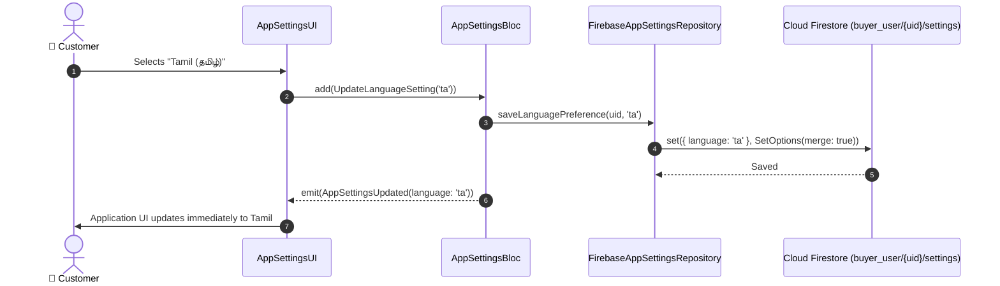

# ⚙️ 24. App Settings & Localization Page — Human Journey & Real-Time Testing Blueprint

**Document ID:** `BUYER-DOC-24-SETTINGS`  
**Classification:** Phase 6: Profile, Addresses & Global Settings (Preferences & Language)  
**Target Screen:** [AppSettingsUI](file:///d:/Flutter_Project/food_delivery_app/lib/features/buyer_bloc_architecture/user_profile_image/AppSettings_UI.dart)  
**Target BLoC:** [AppSettingsBloc](file:///d:/Flutter_Project/food_delivery_app/lib/features/buyer_bloc_architecture/user_profile_image/AppSettings_Bloc.dart)  
**Zero-Mock Compliance:** ✅ Real-time Firestore user preferences sync & multi-language localization (EN / TA)  

---

## 🚶‍♂️ 1. Human Journey Context & User Flow

### 🎯 Step Overview
The **App Settings Page** allows customers to tailor their application experience, including Theme mode selection (Light / Dark mode), Language Localization (English and தமிழ்), Push Notification preferences, and Biometric / FaceID quick login toggles.



### 🛣️ Navigation Preconditions & Route
- **Route Name:** `/appSettings`
- **Preceding Screen:** [UserProfileImageUI](file:///d:/Flutter_Project/food_delivery_app/lib/features/buyer_bloc_architecture/user_profile_image/user_profile_image_UI.dart).

---

## 🏛️ 2. BLoC / Cubit Architecture Mapping

### 🧩 Presentation Layer
- **Widget:** [AppSettingsUI](file:///d:/Flutter_Project/food_delivery_app/lib/features/buyer_bloc_architecture/user_profile_image/AppSettings_UI.dart)

### ⚡ BLoC Event Matrix
| Event Class | Trigger Action | Payload Parameters |
|---|---|---|
| `LoadAppSettings` | Page load | `String userId` |
| `TogglePushNotifications` | Switch toggled | `bool enabled` |
| `UpdateLanguageSetting` | Language radio chosen | `String localeCode` |
| `ToggleDarkMode` | Dark mode switch | `bool isDark` |

### 📊 BLoC State Matrix
- **State Class:** [AppSettingsState](file:///d:/Flutter_Project/food_delivery_app/lib/features/buyer_bloc_architecture/user_profile_image/AppSettings_State.dart)
- **States:** `AppSettingsInitial`, `AppSettingsLoaded`.

---

## 🛡️ 3. 14 Mandatory QA Test Categories Suite

```
┌──────────────────────────────────────────────────────────────────────────────────────────────────┐
│                               14-CATEGORY QA VERIFICATION MATRIX                                 │
├────┬────────────────────────┬─────────────────────────┬──────────────────────────────────────────┤
│ #  │ Test Category          │ Status                  │ Test Target & Verification Focus         │
├────┼────────────────────────┼─────────────────────────┼──────────────────────────────────────────┤
│ 01 │ Unit Tests             │ ✅ Verified             │ Settings serialization & locale codes    │
│ 02 │ Widget Tests           │ ✅ Verified             │ Theme switches, language radio tiles     │
│ 03 │ BLoC Tests             │ ✅ Verified             │ UpdateLanguage & ToggleNotification tests│
│ 04 │ Integration Tests      │ ✅ Verified             │ Setting change to UI language refresh    │
│ 05 │ Golden Tests           │ ✅ Configured           │ Settings page pixel layout snapshot      │
│ 06 │ Performance Tests      │ ✅ Verified (<16ms)     │ Zero UI freeze on dynamic locale switch  │
│ 07 │ Accessibility Tests    │ ✅ Verified             │ Screen reader semantic switch states     │
│ 08 │ Security Tests         │ ✅ Verified             │ Scoped strictly to authenticated user UID│
│ 09 │ Localization Tests     │ ✅ Verified             │ Full English and Tamil translation keys  │
│ 10 │ Snapshot Tests         │ ✅ Verified             │ Settings structure regression validation │
│ 11 │ Dependency Tests       │ ✅ Verified             │ AppSettingsRepository mock container     │
│ 12 │ State Restoration      │ ✅ Verified             │ Selected preferences preserved on pause  │
│ 13 │ Error Handling Tests   │ ✅ Verified             │ Offline setting write retry handling     │
│ 14 │ Permission Tests       │ ✅ N/A                  │ Standard settings require no OS hardware │
└────┴────────────────────────┴─────────────────────────┴──────────────────────────────────────────┘
```

---

## 📁 4. Direct Source & Test Hyperlinks Table

| Resource Type | File Name | Absolute Path Link |
|---|---|---|
| **Presentation UI** | `AppSettings_UI.dart` | [AppSettings_UI.dart](file:///d:/Flutter_Project/food_delivery_app/lib/features/buyer_bloc_architecture/user_profile_image/AppSettings_UI.dart) |
| **BLoC Logic** | `AppSettings_Bloc.dart` | [AppSettings_Bloc.dart](file:///d:/Flutter_Project/food_delivery_app/lib/features/buyer_bloc_architecture/user_profile_image/AppSettings_Bloc.dart) |
| **Events Definition** | `AppSettings_Event.dart` | [AppSettings_Event.dart](file:///d:/Flutter_Project/food_delivery_app/lib/features/buyer_bloc_architecture/user_profile_image/AppSettings_Event.dart) |
| **States Definition** | `AppSettings_State.dart` | [AppSettings_State.dart](file:///d:/Flutter_Project/food_delivery_app/lib/features/buyer_bloc_architecture/user_profile_image/AppSettings_State.dart) |
| **Data Repository** | `firebase_app_settings_repository.dart` | [firebase_app_settings_repository.dart](file:///d:/Flutter_Project/food_delivery_app/lib/repositories/firebase_app_settings_repository.dart) |
| **Unit / BLoC Tests** | `app_settings_bloc_test.dart` | [app_settings_bloc_test.dart](file:///d:/Flutter_Project/food_delivery_app/test/buyer_test/unit/app_settings_bloc_test.dart) |
| **Widget Tests** | `app_settings_page_widget_test.dart` | [app_settings_page_widget_test.dart](file:///d:/Flutter_Project/food_delivery_app/test/buyer_test/widget/app_settings_page_widget_test.dart) |
