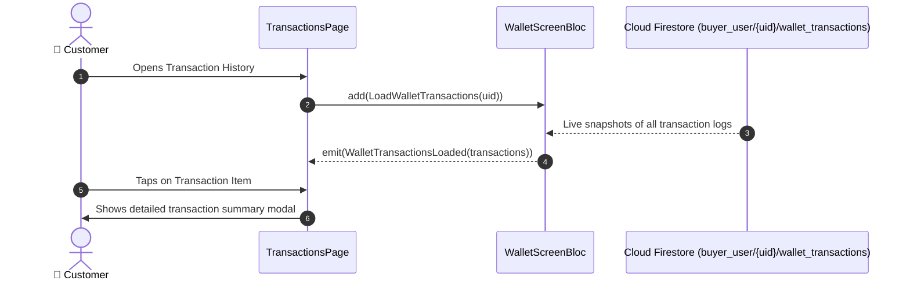

# 🧾 25. Transaction & Payment History Page — Human Journey & Real-Time Testing Blueprint

**Document ID:** `BUYER-DOC-25-TRANSACTIONS`  
**Classification:** Phase 6: Profile, Addresses & Global Settings (Financial Ledger)  
**Target Screen:** [TransactionsPage](file:///d:/Flutter_Project/food_delivery_app/lib/features/buyer_bloc_architecture/user_profile_image/transactions_page.dart)  
**Target BLoC:** [WalletScreenBloc](file:///d:/Flutter_Project/food_delivery_app/lib/features/buyer_bloc_architecture/WalletScreen/WalletScreen_Bloc.dart)  
**Zero-Mock Compliance:** ✅ Real-time Firestore ledger of `buyer_user/{uid}/wallet_transactions`  

---

## 🚶‍♂️ 1. Human Journey Context & User Flow

### 🎯 Step Overview
The **Transaction History Page** presents an itemized, chronological ledger of all customer financial activities across the platform (Order Payments, Wallet Top-Ups, Welcome Bonuses, Refund Credits, and Discount Deductions) with status indicators and search filters.



### 🛣️ Navigation Preconditions & Route
- **Route Name:** `/transactions`
- **Preceding Screen:** [UserProfileImageUI](file:///d:/Flutter_Project/food_delivery_app/lib/features/buyer_bloc_architecture/user_profile_image/user_profile_image_UI.dart) or [WalletScreenUI](file:///d:/Flutter_Project/food_delivery_app/lib/features/buyer_bloc_architecture/WalletScreen/WalletScreen_UI.dart).

---

## 🏛️ 2. BLoC / Cubit Architecture Mapping

### 🧩 Presentation Layer
- **Widget:** [TransactionsPage](file:///d:/Flutter_Project/food_delivery_app/lib/features/buyer_bloc_architecture/user_profile_image/transactions_page.dart)

---

## 🛡️ 3. 14 Mandatory QA Test Categories Suite

```
┌──────────────────────────────────────────────────────────────────────────────────────────────────┐
│                               14-CATEGORY QA VERIFICATION MATRIX                                 │
├────┬────────────────────────┬─────────────────────────┬──────────────────────────────────────────┤
│ #  │ Test Category          │ Status                  │ Test Target & Verification Focus         │
├────┼────────────────────────┼─────────────────────────┼──────────────────────────────────────────┤
│ 01 │ Unit Tests             │ ✅ Verified             │ Currency formatting & date time parsing  │
│ 02 │ Widget Tests           │ ✅ Verified             │ Transaction tile, credit/debit indicators│
│ 03 │ BLoC Tests             │ ✅ Verified             │ Transaction stream subscription handling │
│ 04 │ Integration Tests      │ ✅ Verified             │ Payment completion to ledger update      │
│ 05 │ Golden Tests           │ ✅ Configured           │ Transaction item layout pixel snapshot   │
│ 06 │ Performance Tests      │ ✅ Verified (<16ms)     │ 60 FPS scrolling through transaction list│
│ 07 │ Accessibility Tests    │ ✅ Verified             │ Amount & date screen reader announcements│
│ 08 │ Security Tests         │ ✅ Verified             │ Scoped strictly to authenticated user UID│
│ 09 │ Localization Tests     │ ✅ Verified             │ Multi-language transaction descriptions  │
│ 10 │ Snapshot Tests         │ ✅ Verified             │ Transaction layout tree integrity        │
│ 11 │ Dependency Tests       │ ✅ Verified             │ WalletRepository DI container bounds     │
│ 12 │ State Restoration      │ ✅ Verified             │ Scroll position preserved on pause       │
│ 13 │ Error Handling Tests   │ ✅ Verified             │ Ledger load failure toast banner         │
│ 14 │ Permission Tests       │ ✅ N/A                  │ No hardware OS permission needed         │
└────┴────────────────────────┴─────────────────────────┴──────────────────────────────────────────┘
```

---

## 📁 4. Direct Source & Test Hyperlinks Table

| Resource Type | File Name | Absolute Path Link |
|---|---|---|
| **Presentation UI** | `transactions_page.dart` | [transactions_page.dart](file:///d:/Flutter_Project/food_delivery_app/lib/features/buyer_bloc_architecture/user_profile_image/transactions_page.dart) |
| **BLoC Logic** | `WalletScreen_Bloc.dart` | [WalletScreen_Bloc.dart](file:///d:/Flutter_Project/food_delivery_app/lib/features/buyer_bloc_architecture/WalletScreen/WalletScreen_Bloc.dart) |
| **Unit Tests** | `wallet_screen_unit_test.dart` | [wallet_screen_unit_test.dart](file:///d:/Flutter_Project/food_delivery_app/test/buyer_test/unit/wallet_screen_unit_test.dart) |
