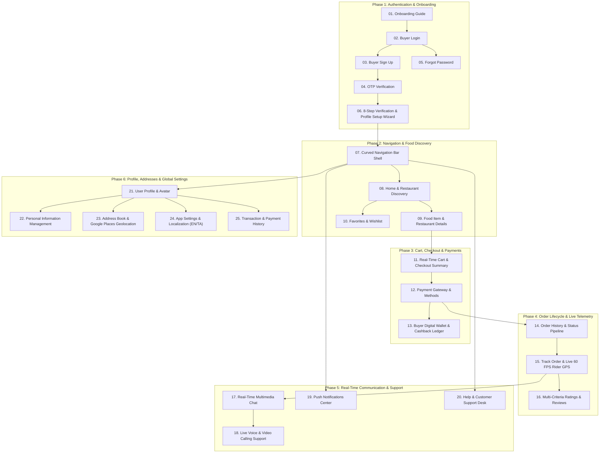

# 🛒 Buyer BLoC Architecture — Master Human Journey & Real-Time Testing Roadmap

**Classification:** Enterprise Architecture, Human Journey Mapping & QA Test Matrix  
**Target Domain:** Buyer (Customer / Consumer) BLoC Architecture  
**Database Engine:** Google Cloud Firestore (`asia-south1`) | **Backend Functions:** Firebase Cloud Functions  
**Zero-Mock Compliance:** ✅ Strict 100% Real-Time Firestore Integration (No Local Fallbacks / Hardcoded Stubs)  
**Total Buyer Modules:** 25 Feature Modules Across 6 Chronological Journey Phases  

---

## 🧭 1. Executive Human Journey Map (The Buyer Experience Lifecycle)

A consumer / buyer interacts with the food delivery application in a structured, real-time reactive lifecycle (Human Journey). Every screen serves a distinct operational purpose in this journey:



---

## 📑 2. Complete 25-Module Master Inventory & Navigation Matrix

| # | Feature Module | Directory Location | Primary UI Widget | Primary BLoC Class | Real-Time Firestore Source | Detailed Journey Guide |
|---|---|---|---|---|---|---|
| **01** | **Onboarding Guide** | `onboarding_page/` | [OnboardingPage](file:///d:/Flutter_Project/food_delivery_app/lib/features/buyer_bloc_architecture/onboarding_page/onboarding_page_UI.dart) | [OnboardingPageBloc](file:///d:/Flutter_Project/food_delivery_app/lib/features/buyer_bloc_architecture/onboarding_page/onboarding_page_Bloc.dart) | Firebase Auth State Listener | [01_BUYER_ONBOARDING_PAGE.md](file:///d:/Flutter_Project/food_delivery_app/md_files/05_Buyer_Human_Journey_And_Testing/01_Auth_And_Onboarding/01_BUYER_ONBOARDING_PAGE.md) |
| **02** | **Buyer Login** | `buyer_login_page/` | [BuyerLoginPageUI](file:///d:/Flutter_Project/food_delivery_app/lib/features/buyer_bloc_architecture/buyer_login_page/buyer_login_page_ui.dart) | [BuyerLoginPageBloc](file:///d:/Flutter_Project/food_delivery_app/lib/features/buyer_bloc_architecture/buyer_login_page/buyer_login_page_bloc.dart) | `buyer_user/{uid}` + Firebase Auth | [02_BUYER_LOGIN_PAGE.md](file:///d:/Flutter_Project/food_delivery_app/md_files/05_Buyer_Human_Journey_And_Testing/01_Auth_And_Onboarding/02_BUYER_LOGIN_PAGE.md) |
| **03** | **Buyer Sign Up** | `buyer_sign_up_page/` | [BuyerSignUpPageUI](file:///d:/Flutter_Project/food_delivery_app/lib/features/buyer_bloc_architecture/buyer_sign_up_page/buyer_sign_up_page_ui.dart) | [BuyerSignUpBloc](file:///d:/Flutter_Project/food_delivery_app/lib/features/buyer_bloc_architecture/buyer_sign_up_page/buyer_sign_up_page_bloc.dart) | `buyer_user/{uid}` + Phone Auth | [03_BUYER_SIGN_UP_PAGE.md](file:///d:/Flutter_Project/food_delivery_app/md_files/05_Buyer_Human_Journey_And_Testing/01_Auth_And_Onboarding/03_BUYER_SIGN_UP_PAGE.md) |
| **04** | **OTP Verification** | `buyer_otp_verification_page/` | [BuyerOtpVerificationPageUI](file:///d:/Flutter_Project/food_delivery_app/lib/features/buyer_bloc_architecture/buyer_otp_verification_page/buyer_otp_verification_page_ui.dart) | [BuyerOtpBloc](file:///d:/Flutter_Project/food_delivery_app/lib/features/buyer_bloc_architecture/buyer_otp_verification_page/buyer_otp_verification_page_bloc.dart) | Firebase Phone Auth Credential | [04_BUYER_OTP_VERIFICATION_PAGE.md](file:///d:/Flutter_Project/food_delivery_app/md_files/05_Buyer_Human_Journey_And_Testing/01_Auth_And_Onboarding/04_BUYER_OTP_VERIFICATION_PAGE.md) |
| **05** | **Forgot Password** | `buyer_forgot_password_page/` | [BuyerForgotPasswordPageUI](file:///d:/Flutter_Project/food_delivery_app/lib/features/buyer_bloc_architecture/buyer_forgot_password_page/buyer_forgot_password_page_ui.dart) | [BuyerForgotPasswordBloc](file:///d:/Flutter_Project/food_delivery_app/lib/features/buyer_bloc_architecture/buyer_forgot_password_page/buyer_forgot_password_page_bloc.dart) | Firebase Auth Password Reset | [05_BUYER_FORGOT_PASSWORD_PAGE.md](file:///d:/Flutter_Project/food_delivery_app/md_files/05_Buyer_Human_Journey_And_Testing/01_Auth_And_Onboarding/05_BUYER_FORGOT_PASSWORD_PAGE.md) |
| **06** | **8-Step Verification Wizard** | `buyer_onboarding_verification_page/` | [BuyerOnboardingVerificationPage](file:///d:/Flutter_Project/food_delivery_app/lib/features/buyer_bloc_architecture/buyer_onboarding_verification_page/buyer_onboarding_verification_ui.dart) | [BuyerOnboardingVerificationBloc](file:///d:/Flutter_Project/food_delivery_app/lib/features/buyer_bloc_architecture/buyer_onboarding_verification_page/buyer_onboarding_verification_bloc.dart) | `buyer_user/{uid}` (8-Step KYC & Setup) | [06_BUYER_VERIFICATION_WIZARD_PAGE.md](file:///d:/Flutter_Project/food_delivery_app/md_files/05_Buyer_Human_Journey_And_Testing/01_Auth_And_Onboarding/06_BUYER_VERIFICATION_WIZARD_PAGE.md) |
| **07** | **Curved Navigation Bar** | `CurvedNavigationBarView/` | [CurvedNavigationBarView](file:///d:/Flutter_Project/food_delivery_app/lib/features/buyer_bloc_architecture/CurvedNavigationBarView/CurvedNavigationBarView.dart) | Dynamic Tab & Badge Controller | Real-Time Badge Stream | [07_CURVED_NAVIGATION_BAR_VIEW.md](file:///d:/Flutter_Project/food_delivery_app/md_files/05_Buyer_Human_Journey_And_Testing/02_Navigation_And_Discovery/07_CURVED_NAVIGATION_BAR_VIEW.md) |
| **08** | **Buyer Home Discovery** | `home_Page/` | [HomePageUI](file:///d:/Flutter_Project/food_delivery_app/lib/features/buyer_bloc_architecture/home_Page/home_Page_UI.dart) | [HomePageBloc](file:///d:/Flutter_Project/food_delivery_app/lib/features/buyer_bloc_architecture/home_Page/home_Page_Bloc.dart) | `products` + `sellers` (Live Stream) | [08_BUYER_HOME_PAGE.md](file:///d:/Flutter_Project/food_delivery_app/md_files/05_Buyer_Human_Journey_And_Testing/02_Navigation_And_Discovery/08_BUYER_HOME_PAGE.md) |
| **09** | **Food Item Details** | `Details_Page/` | [DetailsPageUI](file:///d:/Flutter_Project/food_delivery_app/lib/features/buyer_bloc_architecture/Details_Page/details_page_UI.dart) | [DetailsPageBloc](file:///d:/Flutter_Project/food_delivery_app/lib/features/buyer_bloc_architecture/Details_Page/details_page_Bloc.dart) | `products/{id}` + Modifiers | [09_FOOD_DETAILS_PAGE.md](file:///d:/Flutter_Project/food_delivery_app/md_files/05_Buyer_Human_Journey_And_Testing/02_Navigation_And_Discovery/09_FOOD_DETAILS_PAGE.md) |
| **10** | **Favorites & Wishlist** | `Favorites_Page/` | [FavoritesPageUI](file:///d:/Flutter_Project/food_delivery_app/lib/features/buyer_bloc_architecture/Favorites_Page/favorites_UI.dart) | [FavoritesBloc](file:///d:/Flutter_Project/food_delivery_app/lib/features/buyer_bloc_architecture/Favorites_Page/favorites_bloc.dart) | `buyer_user/{uid}/favorites` | [10_FAVORITES_WISHLIST_PAGE.md](file:///d:/Flutter_Project/food_delivery_app/md_files/05_Buyer_Human_Journey_And_Testing/02_Navigation_And_Discovery/10_FAVORITES_WISHLIST_PAGE.md) |
| **11** | **Cart & Checkout** | `Cart Page/` | [CartPageUI](file:///d:/Flutter_Project/food_delivery_app/lib/features/buyer_bloc_architecture/Cart%20Page/cart_page_UI.dart) | [CartPageBloc](file:///d:/Flutter_Project/food_delivery_app/lib/features/buyer_bloc_architecture/Cart%20Page/cart_page_Bloc.dart) | `buyer_user/{uid}/cart` + Coupons | [11_CART_AND_CHECKOUT_PAGE.md](file:///d:/Flutter_Project/food_delivery_app/md_files/05_Buyer_Human_Journey_And_Testing/03_Cart_Checkout_And_Payments/11_CART_AND_CHECKOUT_PAGE.md) |
| **12** | **Payment Methods** | `PaymentMethodsPage/` | [PaymentMethodsUI](file:///d:/Flutter_Project/food_delivery_app/lib/features/buyer_bloc_architecture/PaymentMethodsPage/PaymentMethods_UI.dart) | [PaymentMethodsBloc](file:///d:/Flutter_Project/food_delivery_app/lib/features/buyer_bloc_architecture/PaymentMethodsPage/PaymentMethods_Bloc.dart) | Payment Token Gateways | [12_PAYMENT_METHODS_PAGE.md](file:///d:/Flutter_Project/food_delivery_app/md_files/05_Buyer_Human_Journey_And_Testing/03_Cart_Checkout_And_Payments/12_PAYMENT_METHODS_PAGE.md) |
| **13** | **Buyer Wallet** | `WalletScreen/` | [WalletScreenUI](file:///d:/Flutter_Project/food_delivery_app/lib/features/buyer_bloc_architecture/WalletScreen/WalletScreen_UI.dart) | [WalletScreenBloc](file:///d:/Flutter_Project/food_delivery_app/lib/features/buyer_bloc_architecture/WalletScreen/WalletScreen_Bloc.dart) | `buyer_user/{uid}/wallet` | [13_BUYER_WALLET_PAGE.md](file:///d:/Flutter_Project/food_delivery_app/md_files/05_Buyer_Human_Journey_And_Testing/03_Cart_Checkout_And_Payments/13_BUYER_WALLET_PAGE.md) |
| **14** | **Order Pipeline & History** | `Order Page/` | [OrderPageUI](file:///d:/Flutter_Project/food_delivery_app/lib/features/buyer_bloc_architecture/Order%20Page/order_UI.dart) | [OrderBloc](file:///d:/Flutter_Project/food_delivery_app/lib/features/buyer_bloc_architecture/Order%20Page/order_Bloc.dart) | `orders` where buyerId == uid | [14_ORDER_LIST_AND_HISTORY_PAGE.md](file:///d:/Flutter_Project/food_delivery_app/md_files/05_Buyer_Human_Journey_And_Testing/04_Order_Lifecycle_And_Tracking/14_ORDER_LIST_AND_HISTORY_PAGE.md) |
| **15** | **Live Order GPS Tracking** | `Track_Order_page/` | [TrackOrderPageUI](file:///d:/Flutter_Project/food_delivery_app/lib/features/buyer_bloc_architecture/Track_Order_page/Track_Order_page_ui.dart) | [TrackOrderBloc](file:///d:/Flutter_Project/food_delivery_app/lib/features/buyer_bloc_architecture/Track_Order_page/Track_Order_page_bloc.dart) | `delivery_partners/{id}/riders` | [15_TRACK_ORDER_LIVE_GPS_PAGE.md](file:///d:/Flutter_Project/food_delivery_app/md_files/05_Buyer_Human_Journey_And_Testing/04_Order_Lifecycle_And_Tracking/15_TRACK_ORDER_LIVE_GPS_PAGE.md) |
| **16** | **Ratings & Reviews** | `Rating_page/` | [RatingPageUI](file:///d:/Flutter_Project/food_delivery_app/lib/features/buyer_bloc_architecture/Rating_page/Rating_page_ui.dart) | [RatingPageBloc](file:///d:/Flutter_Project/food_delivery_app/lib/features/buyer_bloc_architecture/Rating_page/Rating_page_bloc.dart) | `ratings` + `sellers/{id}/ratings` | [16_RATINGS_AND_REVIEWS_PAGE.md](file:///d:/Flutter_Project/food_delivery_app/md_files/05_Buyer_Human_Journey_And_Testing/04_Order_Lifecycle_And_Tracking/16_RATINGS_AND_REVIEWS_PAGE.md) |
| **17** | **Real-Time Multimedia Chat** | `Chat_Page/` | [BuyerChatUI](file:///d:/Flutter_Project/food_delivery_app/lib/features/buyer_bloc_architecture/Chat_Page/buyer_chat_ui.dart) | [BuyerChatBloc](file:///d:/Flutter_Project/food_delivery_app/lib/features/buyer_bloc_architecture/Chat_Page/buyer_chat_bloc.dart) | `conversations/{chatId}/messages` | [17_BUYER_CHAT_PAGE.md](file:///d:/Flutter_Project/food_delivery_app/md_files/05_Buyer_Human_Journey_And_Testing/05_Communication_And_Support/17_BUYER_CHAT_PAGE.md) |
| **18** | **Voice & Video Calling** | `Chat_Page/` | [VoiceCallPage](file:///d:/Flutter_Project/food_delivery_app/lib/features/buyer_bloc_architecture/Chat_Page/voice_call_page.dart) | [VideoCallBloc](file:///d:/Flutter_Project/food_delivery_app/lib/features/buyer_bloc_architecture/Chat_Page/video_call_bloc.dart) | WebRTC / Agora Signaling Streams | [18_VOICE_AND_VIDEO_CALL_PAGE.md](file:///d:/Flutter_Project/food_delivery_app/md_files/05_Buyer_Human_Journey_And_Testing/05_Communication_And_Support/18_VOICE_AND_VIDEO_CALL_PAGE.md) |
| **19** | **Push Notifications Hub** | `Notifications_page/` | [BuyerNotificationUI](file:///d:/Flutter_Project/food_delivery_app/lib/features/buyer_bloc_architecture/Notifications_page/buyer_notification_ui.dart) | [BuyerNotificationBloc](file:///d:/Flutter_Project/food_delivery_app/lib/features/buyer_bloc_architecture/Notifications_page/buyer_notification_bloc.dart) | `buyer_user/{uid}/notifications` | [19_BUYER_NOTIFICATIONS_PAGE.md](file:///d:/Flutter_Project/food_delivery_app/md_files/05_Buyer_Human_Journey_And_Testing/05_Communication_And_Support/19_BUYER_NOTIFICATIONS_PAGE.md) |
| **20** | **Help & Support Desk** | `HelpSupportPage/` | [HelpSupportUI](file:///d:/Flutter_Project/food_delivery_app/lib/features/buyer_bloc_architecture/HelpSupportPage/HelpSupport_UI.dart) | [HelpSupportBloc](file:///d:/Flutter_Project/food_delivery_app/lib/features/buyer_bloc_architecture/HelpSupportPage/HelpSupport_Bloc.dart) | `support_tickets/{ticketId}` | [20_HELP_AND_SUPPORT_PAGE.md](file:///d:/Flutter_Project/food_delivery_app/md_files/05_Buyer_Human_Journey_And_Testing/05_Communication_And_Support/20_HELP_AND_SUPPORT_PAGE.md) |
| **21** | **Buyer Profile & Avatar** | `user_profile_image/` | [UserProfileImageUI](file:///d:/Flutter_Project/food_delivery_app/lib/features/buyer_bloc_architecture/user_profile_image/user_profile_image_UI.dart) | [UserProfileImageBloc](file:///d:/Flutter_Project/food_delivery_app/lib/features/buyer_bloc_architecture/user_profile_image/user_profile_image_Bloc.dart) | `buyer_user/{uid}` (Live Profile Stream) | [21_BUYER_PROFILE_PAGE.md](file:///d:/Flutter_Project/food_delivery_app/md_files/05_Buyer_Human_Journey_And_Testing/06_Profile_Address_And_Settings/21_BUYER_PROFILE_PAGE.md) |
| **22** | **Personal Information** | `user_profile_image/pages/` | [PersonalInformationPage](file:///d:/Flutter_Project/food_delivery_app/lib/features/buyer_bloc_architecture/user_profile_image/pages/personal_information_page.dart) | [UserProfileImageBloc](file:///d:/Flutter_Project/food_delivery_app/lib/features/buyer_bloc_architecture/user_profile_image/user_profile_image_Bloc.dart) | `buyer_user/{uid}` Personal Data | [22_PERSONAL_INFORMATION_PAGE.md](file:///d:/Flutter_Project/food_delivery_app/md_files/05_Buyer_Human_Journey_And_Testing/06_Profile_Address_And_Settings/22_PERSONAL_INFORMATION_PAGE.md) |
| **23** | **Address Book & Geolocation** | `user_profile_image/pages/` | [AddressManagementPage](file:///d:/Flutter_Project/food_delivery_app/lib/features/buyer_bloc_architecture/user_profile_image/pages/address_management_page.dart) | [UserProfileImageBloc](file:///d:/Flutter_Project/food_delivery_app/lib/features/buyer_bloc_architecture/user_profile_image/user_profile_image_Bloc.dart) | `buyer_user/{uid}/addresses` | [23_ADDRESS_MANAGEMENT_AND_GEOLOCATION_PAGE.md](file:///d:/Flutter_Project/food_delivery_app/md_files/05_Buyer_Human_Journey_And_Testing/06_Profile_Address_And_Settings/23_ADDRESS_MANAGEMENT_AND_GEOLOCATION_PAGE.md) |
| **24** | **App Settings & Language** | `user_profile_image/` | [AppSettingsUI](file:///d:/Flutter_Project/food_delivery_app/lib/features/buyer_bloc_architecture/user_profile_image/AppSettings_UI.dart) | [AppSettingsBloc](file:///d:/Flutter_Project/food_delivery_app/lib/features/buyer_bloc_architecture/user_profile_image/AppSettings_Bloc.dart) | `buyer_user/{uid}/settings` | [24_APP_SETTINGS_AND_LOCALIZATION_PAGE.md](file:///d:/Flutter_Project/food_delivery_app/md_files/05_Buyer_Human_Journey_And_Testing/06_Profile_Address_And_Settings/24_APP_SETTINGS_AND_LOCALIZATION_PAGE.md) |
| **25** | **Transaction History** | `user_profile_image/` | [TransactionsPage](file:///d:/Flutter_Project/food_delivery_app/lib/features/buyer_bloc_architecture/user_profile_image/transactions_page.dart) | [WalletScreenBloc](file:///d:/Flutter_Project/food_delivery_app/lib/features/buyer_bloc_architecture/WalletScreen/WalletScreen_Bloc.dart) | `buyer_user/{uid}/wallet_transactions` | [25_TRANSACTION_HISTORY_PAGE.md](file:///d:/Flutter_Project/food_delivery_app/md_files/05_Buyer_Human_Journey_And_Testing/06_Profile_Address_And_Settings/25_TRANSACTION_HISTORY_PAGE.md) |

---

## 🧪 3. 14 Mandatory QA Test Categories Framework

Every buyer documentation file incorporates exhaustive testing specifications across all 14 mandatory QA test categories:

```
┌────────────────────────────────────────────────────────────────────────────────────────────────────────┐
│                               14 MANDATORY TEST CATEGORIES MATRIX                                      │
│                                (Applied Uniformly Across All Buyer Modules)                             │
├────┬──────────────────────┬────────────────────────────────────────────────────────────────────────────┤
│ 01 │ Unit Tests           │ Business calculations, discount formulas, model JSON parsing, validators   │
│ 02 │ Widget Tests         │ UI rendering, element tree inspection, user tap gestures, form validation │
│ 03 │ BLoC Tests           │ State emission verification using `blocTest`, state sequencing & triggers  │
│ 04 │ Integration Tests    │ End-to-end multi-screen journeys, real Firestore stream synchronization    │
│ 05 │ Golden Tests         │ Pixel-perfect pixel rendering validation across multiple device DP sizes   │
│ 06 │ Performance Tests    │ 60 FPS animation integrity, live map marker interpolation, memory leak-free│
│ 07 │ Accessibility Tests  │ Screen reader semantic nodes, 48x48 min touch targets, WCAG AA contrast   │
│ 08 │ Security Tests       │ Sanitized inputs, tokenized payments, Firestore security rules enforcement │
│ 09 │ Localization Tests   │ Multi-language support (English, Tamil), RTL/LTR formatting, string keys   │
│ 10 │ Snapshot Tests       │ Static widget tree representation & regression inspection                  │
│ 11 │ Dependency Tests     │ Injection container validation, repository mock separation                 │
│ 12 │ State Restoration    │ App lifecycle background kill / foreground state recovery                  │
│ 13 │ Error Handling Tests │ Firebase network timeout, offline cache handling, edge case error dialogs  │
│ 14 │ Permission Tests     │ Device GPS location, FCM notifications, camera/gallery permissions         │
└────┴──────────────────────┴────────────────────────────────────────────────────────────────────────────┘
```
