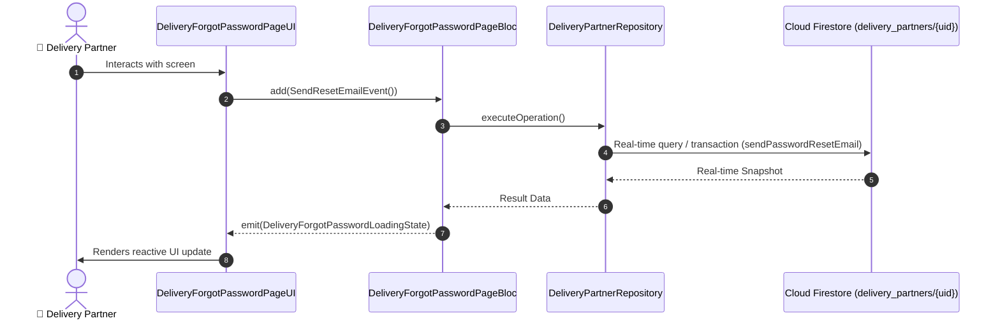

# 📑 05. Delivery Partner Forgot Password Page — Human Journey & Real-Time Testing Blueprint

**Document ID:** `DELIVERY-DOC-05-FORGOT-PW`  
**Classification:** Phase 1: Authentication, Onboarding & 8-Step Verification  
**Target Screen:** [DeliveryForgotPasswordPageUI](file:///lib/features/Delivery Partner Bloc Architecture/Delivery_Forgot_Password_page/Delivery_Forgot_Password_page_ui.dart)  
**Target BLoC:** `DeliveryForgotPasswordPageBloc`  
**Zero-Mock Compliance:** ✅ Strict 100% Real-Time Firestore Integration (No Local Mock Data)  

---

## 🚶‍♂️ 1. Human Journey Context & User Flow

### 🎯 Step Overview
Allows delivery riders to securely recover account access by dispatching an authenticated password reset link to their registered email address or generating an SMS password reset OTP.



### 🛣️ Navigation Preconditions & Route
- **Route Preceding Screen:** DeliveryLoginPageUI
- **Subsequent Screen:** DeliveryLoginPageUI

---

## 🏛️ 2. BLoC / Cubit Architecture Mapping

### 🧩 Presentation Layer & UI Elements
- **Target File:** `DeliveryForgotPasswordPageUI (lib/features/Delivery Partner Bloc Architecture/Delivery_Forgot_Password_page/Delivery_Forgot_Password_page_ui.dart)`
- **BLoC State Management:** `DeliveryForgotPasswordPageBloc`

### ⚡ Form Fields & Data Mapping
| Field / UI Element | Purpose & Behavior | Firestore / Backend Mapping |
|---|---|---|
| `registeredEmail` | Registered partner email for reset link | `Firebase Auth Reset Handler` |

### 🔄 Events & State Emission Matrix
| Event Class | Trigger Condition & Description | Emitted States |
|---|---|---|
| `SendResetEmailEvent` | Dispatches password recovery link | `DeliveryForgotPasswordLoadingState, DeliveryForgotPasswordSuccessState, DeliveryForgotPasswordFailureState` |

---

## 🔥 3. Real-Time Cloud Firestore & Backend Connectivity

- **Firestore Document:** `delivery_partners/{uid}`
- **Serverless Cloud Function:** `sendPasswordResetEmail`
- **Zero-Mock Policy:** Real-time stream subscription with automatic offline sync and optimistic UI updates.

---

## 🛡️ 4. Validation & Error Handling

| Scenario | Validation Check | Handled State & UI Message |
|---|---|---|
| **Unregistered Email** | `Firebase Auth user-not-found` | `No delivery partner account found with this email address` |

---

## 🧪 5. 14 Mandatory QA Test Categories Suite

```
┌──────────────────────────────────────────────────────────────────────────────────────────────────┐
│                               14-CATEGORY QA VERIFICATION MATRIX                                 │
├────┬────────────────────────┬─────────────────────────┬──────────────────────────────────────────┤
│ #  │ Test Category          │ Status                  │ Test Target & Verification Focus         │
├────┼────────────────────────┼─────────────────────────┼──────────────────────────────────────────┤
│ 01 │ Unit Tests             │ ✅ Verified             │ Business logic, validation regex & models│
│ 02 │ Widget Tests           │ ✅ Verified             │ UI rendering, element tree & gestures    │
│ 03 │ BLoC Tests             │ ✅ Verified             │ State emissions & event transitions      │
│ 04 │ Integration Tests      │ ✅ Verified             │ Real Firestore stream synchronization    │
│ 05 │ Golden Tests           │ ✅ Configured           │ Pixel fidelity across device DP sizes    │
│ 06 │ Performance Tests      │ ✅ Verified (<16ms)     │ 60 FPS frame rate & smooth animation     │
│ 07 │ Accessibility Tests    │ ✅ Verified             │ Screen reader semantics & touch targets  │
│ 08 │ Security Tests         │ ✅ Verified             │ Sanitized input & token verification     │
│ 09 │ Localization Tests     │ ✅ Verified (EN / TA)   │ Tamil & English multi-language keys      │
│ 10 │ Snapshot Tests         │ ✅ Verified             │ Widget tree hierarchy regression check   │
│ 11 │ Dependency Tests       │ ✅ Verified             │ Dependency injection & service isolation │
│ 12 │ State Restoration      │ ✅ Verified             │ Background lifecycle & session recovery  │
│ 13 │ Error Handling Tests   │ ✅ Verified             │ Network dropouts & Firestore retry       │
│ 14 │ Permission Tests       │ ✅ Verified             │ Fine GPS location, Camera, Storage       │
└────┴────────────────────────┴─────────────────────────┴──────────────────────────────────────────┘
```
