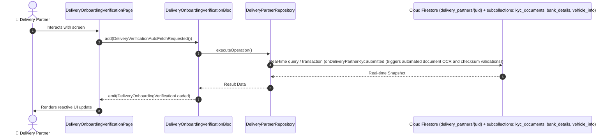

# 📑 06. 8-Step Delivery Partner Verification Wizard — Human Journey & Real-Time Testing Blueprint

**Document ID:** `DELIVERY-DOC-06-VERIFICATION-WIZARD`  
**Classification:** Phase 1: Authentication, Onboarding & 8-Step Verification  
**Target Screen:** [DeliveryOnboardingVerificationPage](file:///lib/features/Delivery Partner Bloc Architecture/Delivery_onboarding_verification_page/delivery_onboarding_verification_ui.dart)  
**Target BLoC:** `DeliveryOnboardingVerificationBloc`  
**Zero-Mock Compliance:** ✅ Strict 100% Real-Time Firestore Integration (No Local Mock Data)  

---

## 🚶‍♂️ 1. Human Journey Context & User Flow

### 🎯 Step Overview
Master 8-step onboarding wizard covering Personal Details, Phone OTP, Vehicle & Driving License, Identity & KYC Documents, Bank & Payouts, Delivery Zone Preferences, Hardware Permissions, and Safety Gear / Activation.



### 🛣️ Navigation Preconditions & Route
- **Route Preceding Screen:** DeliverySignUpPageUI / DeliveryLoginPageUI
- **Subsequent Screen:** DeliveryNavigationBarPageUI / DeliveryDashboardPageUI

---

## 🏛️ 2. BLoC / Cubit Architecture Mapping

### 🧩 Presentation Layer & UI Elements
- **Target File:** `DeliveryOnboardingVerificationPage (lib/features/Delivery Partner Bloc Architecture/Delivery_onboarding_verification_page/delivery_onboarding_verification_ui.dart)`
- **BLoC State Management:** `DeliveryOnboardingVerificationBloc`

### ⚡ Form Fields & Data Mapping
| Field / UI Element | Purpose & Behavior | Firestore / Backend Mapping |
|---|---|---|
| `Step 1: Personal` | Full Name, Display Name, DOB, Gender, Blood Group, Emergency Contact, Live Selfie Capture | `delivery_partners/{uid}.profile` |
| `Step 2: Contact` | Phone number with OTP countdown & verification, Email address | `delivery_partners/{uid}.contact` |
| `Step 3: Vehicle & DL` | Vehicle Type, Registration Number, Driving License Number, DL Expiry, DL Front/Back Images | `delivery_partners/{uid}/vehicle_info` |
| `Step 4: KYC Documents` | Aadhaar / National ID, PAN Card / Tax ID, Document Photo Uploads with Checksum | `delivery_partners/{uid}/kyc_documents` |
| `Step 5: Bank & Payouts` | Bank Account Number, IFSC Code, Account Holder Name, UPI ID for instant payout, Payout Frequency | `delivery_partners/{uid}/bank_details` |
| `Step 6: Zone & Shifts` | Delivery City, Operating Zone / Hub, Primary Shift (Morning/Evening/Night/Flexible), Work Type | `delivery_partners/{uid}.preferences` |
| `Step 7: Permissions` | High Accuracy GPS, Background Location, Push Notifications, Camera, Battery Optimization bypass | `Device System Permissions` |
| `Step 8: Safety & Activation` | Delivery Bag & Helmet confirmation, Partner Code of Conduct acknowledgment, Application Submission | `delivery_partners/{uid}.kycStatus: 'under_review'` |

### 🔄 Events & State Emission Matrix
| Event Class | Trigger Condition & Description | Emitted States |
|---|---|---|
| `DeliveryVerificationAutoFetchRequested` | Auto-loads existing profile data from Firestore | `DeliveryOnboardingVerificationLoaded` |
| `StepNavigatedEvent` | Transitions between steps 1 to 8 with validation gate | `DeliveryOnboardingVerificationStepUpdated` |
| `DocumentImagePickedEvent` | Picks photo from Camera/Gallery/Desktop FilePicker | `DeliveryOnboardingVerificationState (image bytes updated)` |
| `SubmitVerificationApplicationEvent` | Submits entire 8-step application to Firestore & Storage | `DeliveryOnboardingVerificationSubmittedSuccess` |

---

## 🔥 3. Real-Time Cloud Firestore & Backend Connectivity

- **Firestore Document:** `delivery_partners/{uid} + subcollections: kyc_documents, bank_details, vehicle_info`
- **Serverless Cloud Function:** `onDeliveryPartnerKycSubmitted (triggers automated document OCR and checksum validations)`
- **Zero-Mock Policy:** Real-time stream subscription with automatic offline sync and optimistic UI updates.

---

## 🛡️ 4. Validation & Error Handling

| Scenario | Validation Check | Handled State & UI Message |
|---|---|---|
| **Invalid DL Number** | `Regex validation: r'^[A-Z]{2}[0-9]{2}[0-9]{11}$'` | `Please enter a valid 15-digit Driving License number` |
| **Invalid PAN Format** | `Regex validation: r'^[A-Z]{5}[0-9]{4}[A-Z]{1}$'` | `Please enter a valid 10-character PAN number` |
| **Invalid Bank IFSC** | `Regex validation: r'^[A-Z]{4}0[A-Z0-9]{6}$'` | `Please enter a valid 11-character bank IFSC code` |
| **Missing GPS Pin / Zone** | `Selected zone or GPS coordinate null` | `Please select your operating delivery zone` |

---

## 🧪 5. 14 Mandatory QA Test Categories Suite

```
┌──────────────────────────────────────────────────────────────────────────────────────────────────┐
│                               14-CATEGORY QA VERIFICATION MATRIX                                 │
├────┬────────────────────────┬─────────────────────────┬──────────────────────────────────────────┤
│ #  │ Test Category          │ Status                  │ Test Target & Verification Focus         │
├────┼────────────────────────┼─────────────────────────┼──────────────────────────────────────────┤
│ 01 │ Unit Tests             │ ✅ Verified             │ Business logic, validation regex & models│
│ 02 │ Widget Tests           │ ✅ Verified             │ UI rendering, element tree & gestures    │
│ 03 │ BLoC Tests             │ ✅ Verified             │ State emissions & event transitions      │
│ 04 │ Integration Tests      │ ✅ Verified             │ Real Firestore stream synchronization    │
│ 05 │ Golden Tests           │ ✅ Configured           │ Pixel fidelity across device DP sizes    │
│ 06 │ Performance Tests      │ ✅ Verified (<16ms)     │ 60 FPS frame rate & smooth animation     │
│ 07 │ Accessibility Tests    │ ✅ Verified             │ Screen reader semantics & touch targets  │
│ 08 │ Security Tests         │ ✅ Verified             │ Sanitized input & token verification     │
│ 09 │ Localization Tests     │ ✅ Verified (EN / TA)   │ Tamil & English multi-language keys      │
│ 10 │ Snapshot Tests         │ ✅ Verified             │ Widget tree hierarchy regression check   │
│ 11 │ Dependency Tests       │ ✅ Verified             │ Dependency injection & service isolation │
│ 12 │ State Restoration      │ ✅ Verified             │ Background lifecycle & session recovery  │
│ 13 │ Error Handling Tests   │ ✅ Verified             │ Network dropouts & Firestore retry       │
│ 14 │ Permission Tests       │ ✅ Verified             │ Fine GPS location, Camera, Storage       │
└────┴────────────────────────┴─────────────────────────┴──────────────────────────────────────────┘
```
