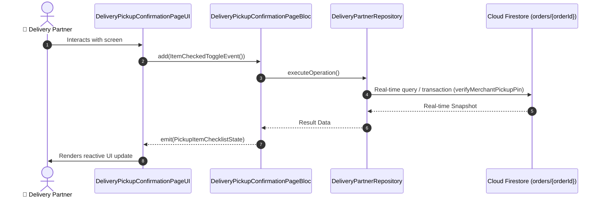

# 📑 12. Store Arrival & Pickup Confirmation Page — Human Journey & Real-Time Testing Blueprint

**Document ID:** `DELIVERY-DOC-12-PICKUP-CONFIRM`  
**Classification:** Phase 3: Order Dispatch, Acceptance & Merchant Pickup  
**Target Screen:** [DeliveryPickupConfirmationPageUI](file:///lib/features/Delivery Partner Bloc Architecture/Delivery_Pickup Confirmation_page/Delivery_Pickup Confirmation_page_ui.dart)  
**Target BLoC:** `DeliveryPickupConfirmationPageBloc`  
**Zero-Mock Compliance:** ✅ Strict 100% Real-Time Firestore Integration (No Local Mock Data)  

---

## 🚶‍♂️ 1. Human Journey Context & User Flow

### 🎯 Step Overview
Store arrival verification and item checklist validation interface. Includes store geofence verification, order item checkbox verification, merchant 4-digit pickup PIN / QR scan verification, and confirmation to enter 'in_transit' mode.



### 🛣️ Navigation Preconditions & Route
- **Route Preceding Screen:** DeliveryOrderDetailsPageUI / DeliveryOrdersPageUI
- **Subsequent Screen:** DeliveryNavigationScreenPageUI (Heading to customer)

---

## 🏛️ 2. BLoC / Cubit Architecture Mapping

### 🧩 Presentation Layer & UI Elements
- **Target File:** `DeliveryPickupConfirmationPageUI (lib/features/Delivery Partner Bloc Architecture/Delivery_Pickup Confirmation_page/Delivery_Pickup Confirmation_page_ui.dart)`
- **BLoC State Management:** `DeliveryPickupConfirmationPageBloc`

### ⚡ Form Fields & Data Mapping
| Field / UI Element | Purpose & Behavior | Firestore / Backend Mapping |
|---|---|---|
| `itemChecklist` | Interactive checkboxes for each packaged item | `Local verification state` |
| `merchantPinInput` | 4-digit pickup confirmation PIN | `orders/{orderId}.pickupPin` |
| `confirmPickupButton` | Proceeds to customer navigation | `Transition to in_transit` |

### 🔄 Events & State Emission Matrix
| Event Class | Trigger Condition & Description | Emitted States |
|---|---|---|
| `ItemCheckedToggleEvent` | Marks individual item as physically verified | `PickupItemChecklistState` |
| `VerifyPickupPinEvent` | Validates merchant pickup PIN | `DeliveryPickupSuccessState` |

---

## 🔥 3. Real-Time Cloud Firestore & Backend Connectivity

- **Firestore Document:** `orders/{orderId}`
- **Serverless Cloud Function:** `verifyMerchantPickupPin`
- **Zero-Mock Policy:** Real-time stream subscription with automatic offline sync and optimistic UI updates.

---

## 🛡️ 4. Validation & Error Handling

| Scenario | Validation Check | Handled State & UI Message |
|---|---|---|
| **Unchecked Items Warning** | `Proceeding with unverified items` | `Please verify all items in the food package before leaving` |
| **Invalid Pickup PIN** | `Incorrect merchant PIN entered` | `Invalid merchant PIN. Please ask kitchen manager for 4-digit code` |

---

## 🧪 5. 14 Mandatory QA Test Categories Suite

```
┌──────────────────────────────────────────────────────────────────────────────────────────────────┐
│                               14-CATEGORY QA VERIFICATION MATRIX                                 │
├────┬────────────────────────┬─────────────────────────┬──────────────────────────────────────────┤
│ #  │ Test Category          │ Status                  │ Test Target & Verification Focus         │
├────┼────────────────────────┼─────────────────────────┼──────────────────────────────────────────┤
│ 01 │ Unit Tests             │ ✅ Verified             │ Business logic, validation regex & models│
│ 02 │ Widget Tests           │ ✅ Verified             │ UI rendering, element tree & gestures    │
│ 03 │ BLoC Tests             │ ✅ Verified             │ State emissions & event transitions      │
│ 04 │ Integration Tests      │ ✅ Verified             │ Real Firestore stream synchronization    │
│ 05 │ Golden Tests           │ ✅ Configured           │ Pixel fidelity across device DP sizes    │
│ 06 │ Performance Tests      │ ✅ Verified (<16ms)     │ 60 FPS frame rate & smooth animation     │
│ 07 │ Accessibility Tests    │ ✅ Verified             │ Screen reader semantics & touch targets  │
│ 08 │ Security Tests         │ ✅ Verified             │ Sanitized input & token verification     │
│ 09 │ Localization Tests     │ ✅ Verified (EN / TA)   │ Tamil & English multi-language keys      │
│ 10 │ Snapshot Tests         │ ✅ Verified             │ Widget tree hierarchy regression check   │
│ 11 │ Dependency Tests       │ ✅ Verified             │ Dependency injection & service isolation │
│ 12 │ State Restoration      │ ✅ Verified             │ Background lifecycle & session recovery  │
│ 13 │ Error Handling Tests   │ ✅ Verified             │ Network dropouts & Firestore retry       │
│ 14 │ Permission Tests       │ ✅ Verified             │ Fine GPS location, Camera, Storage       │
└────┴────────────────────────┴─────────────────────────┴──────────────────────────────────────────┘
```
