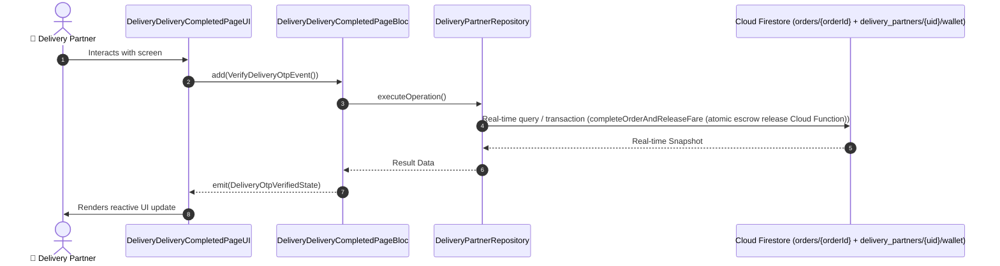

# 📑 14. Doorstep Delivery Completed & OTP Proof Page — Human Journey & Real-Time Testing Blueprint

**Document ID:** `DELIVERY-DOC-14-COMPLETED`  
**Classification:** Phase 4: Turn-By-Turn Navigation & Customer Delivery  
**Target Screen:** [DeliveryDeliveryCompletedPageUI](file:///lib/features/Delivery Partner Bloc Architecture/Delivery_Delivery Completed_page/Delivery_Delivery Completed_page_ui.dart)  
**Target BLoC:** `DeliveryDeliveryCompletedPageBloc`  
**Zero-Mock Compliance:** ✅ Strict 100% Real-Time Firestore Integration (No Local Mock Data)  

---

## 🚶‍♂️ 1. Human Journey Context & User Flow

### 🎯 Step Overview
Final delivery completion and proof-of-delivery screen. Features 4-digit customer delivery OTP verification, contactless delivery photo capture, COD cash collection confirmation, instantaneous wallet fare credit, and congratulatory summary celebration.



### 🛣️ Navigation Preconditions & Route
- **Route Preceding Screen:** DeliveryNavigationScreenPageUI
- **Subsequent Screen:** DeliveryDashboardPageUI

---

## 🏛️ 2. BLoC / Cubit Architecture Mapping

### 🧩 Presentation Layer & UI Elements
- **Target File:** `DeliveryDeliveryCompletedPageUI (lib/features/Delivery Partner Bloc Architecture/Delivery_Delivery Completed_page/Delivery_Delivery Completed_page_ui.dart)`
- **BLoC State Management:** `DeliveryDeliveryCompletedPageBloc`

### ⚡ Form Fields & Data Mapping
| Field / UI Element | Purpose & Behavior | Firestore / Backend Mapping |
|---|---|---|
| `customerDeliveryOtp` | 4-digit OTP provided by customer at doorstep | `orders/{orderId}.deliveryOtp` |
| `podCameraCapture` | Photo proof of delivery (for contactless drop) | `Firebase Storage pod_images/` |
| `codAmountCollected` | Cash collection confirmation checkbox (if COD) | `orders/{orderId}.codCollected` |
| `tripEarningsSummary` | Base fare, distance pay, surge bonus, and customer tip credit | `Earnings Ledger` |

### 🔄 Events & State Emission Matrix
| Event Class | Trigger Condition & Description | Emitted States |
|---|---|---|
| `VerifyDeliveryOtpEvent` | Validates 4-digit customer OTP | `DeliveryOtpVerifiedState` |
| `SubmitDeliveryProofEvent` | Uploads photo proof and completes order | `DeliveryCompletedSuccessState` |

---

## 🔥 3. Real-Time Cloud Firestore & Backend Connectivity

- **Firestore Document:** `orders/{orderId} + delivery_partners/{uid}/wallet`
- **Serverless Cloud Function:** `completeOrderAndReleaseFare (atomic escrow release Cloud Function)`
- **Zero-Mock Policy:** Real-time stream subscription with automatic offline sync and optimistic UI updates.

---

## 🛡️ 4. Validation & Error Handling

| Scenario | Validation Check | Handled State & UI Message |
|---|---|---|
| **Invalid Delivery OTP** | `Entered code != orders/{orderId}.deliveryOtp` | `Invalid customer delivery OTP. Please verify with customer` |
| **Uncollected COD Cash** | `COD order submitted without cash confirmation` | `Please confirm that exact cash was collected from customer` |

---

## 🧪 5. 14 Mandatory QA Test Categories Suite

```
┌──────────────────────────────────────────────────────────────────────────────────────────────────┐
│                               14-CATEGORY QA VERIFICATION MATRIX                                 │
├────┬────────────────────────┬─────────────────────────┬──────────────────────────────────────────┤
│ #  │ Test Category          │ Status                  │ Test Target & Verification Focus         │
├────┼────────────────────────┼─────────────────────────┼──────────────────────────────────────────┤
│ 01 │ Unit Tests             │ ✅ Verified             │ Business logic, validation regex & models│
│ 02 │ Widget Tests           │ ✅ Verified             │ UI rendering, element tree & gestures    │
│ 03 │ BLoC Tests             │ ✅ Verified             │ State emissions & event transitions      │
│ 04 │ Integration Tests      │ ✅ Verified             │ Real Firestore stream synchronization    │
│ 05 │ Golden Tests           │ ✅ Configured           │ Pixel fidelity across device DP sizes    │
│ 06 │ Performance Tests      │ ✅ Verified (<16ms)     │ 60 FPS frame rate & smooth animation     │
│ 07 │ Accessibility Tests    │ ✅ Verified             │ Screen reader semantics & touch targets  │
│ 08 │ Security Tests         │ ✅ Verified             │ Sanitized input & token verification     │
│ 09 │ Localization Tests     │ ✅ Verified (EN / TA)   │ Tamil & English multi-language keys      │
│ 10 │ Snapshot Tests         │ ✅ Verified             │ Widget tree hierarchy regression check   │
│ 11 │ Dependency Tests       │ ✅ Verified             │ Dependency injection & service isolation │
│ 12 │ State Restoration      │ ✅ Verified             │ Background lifecycle & session recovery  │
│ 13 │ Error Handling Tests   │ ✅ Verified             │ Network dropouts & Firestore retry       │
│ 14 │ Permission Tests       │ ✅ Verified             │ Fine GPS location, Camera, Storage       │
└────┴────────────────────────┴─────────────────────────┴──────────────────────────────────────────┘
```
