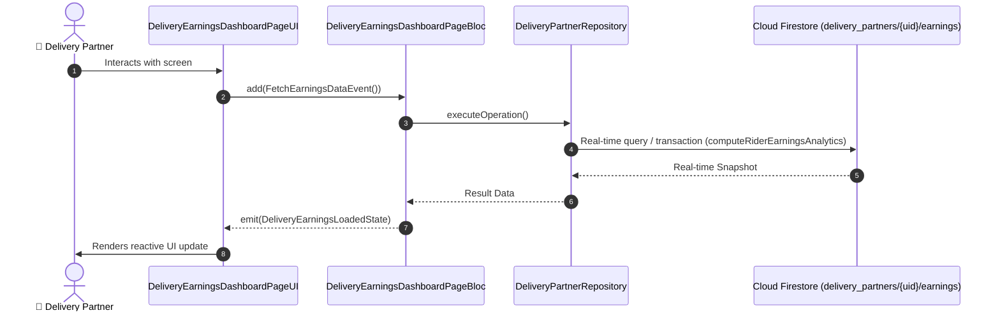

# 📑 15. Rider Earnings Analytics & Daily Breakdown Page — Human Journey & Real-Time Testing Blueprint

**Document ID:** `DELIVERY-DOC-15-EARNINGS`  
**Classification:** Phase 5: Financials, Wallet, Earnings & Incentives  
**Target Screen:** [DeliveryEarningsDashboardPageUI](file:///lib/features/Delivery Partner Bloc Architecture/Delivery_Earnings Dashboard_page/Delivery_Earnings Dashboard_page_ui.dart)  
**Target BLoC:** `DeliveryEarningsDashboardPageBloc`  
**Zero-Mock Compliance:** ✅ Strict 100% Real-Time Firestore Integration (No Local Mock Data)  

---

## 🚶‍♂️ 1. Human Journey Context & User Flow

### 🎯 Step Overview
Comprehensive financial analytics dashboard providing daily, weekly, and monthly earnings breakdown, itemized trip earnings, peak-hour surge multipliers, tip credits, active work hours, and PDF statement export.



### 🛣️ Navigation Preconditions & Route
- **Route Preceding Screen:** DeliveryNavigationBarPageUI / DeliveryDashboardPageUI
- **Subsequent Screen:** DeliveryWalletPageUI / DeliveryIncentivesDashboardPageUI

---

## 🏛️ 2. BLoC / Cubit Architecture Mapping

### 🧩 Presentation Layer & UI Elements
- **Target File:** `DeliveryEarningsDashboardPageUI (lib/features/Delivery Partner Bloc Architecture/Delivery_Earnings Dashboard_page/Delivery_Earnings Dashboard_page_ui.dart)`
- **BLoC State Management:** `DeliveryEarningsDashboardPageBloc`

### ⚡ Form Fields & Data Mapping
| Field / UI Element | Purpose & Behavior | Firestore / Backend Mapping |
|---|---|---|
| `timeframeSelector` | Day / Week / Month tab switcher | `Analytics Filter` |
| `totalEarningsMetric` | Net earned revenue in selected period | `delivery_partners/{uid}/earnings.netTotal` |
| `earningsChart` | Bar / line chart showing peak earning hours | `Hourly Breakdown` |
| `tripsFareBreakdown` | Base fare, distance pay, waiting time, customer tips, bonuses | `Itemized Ledger` |

### 🔄 Events & State Emission Matrix
| Event Class | Trigger Condition & Description | Emitted States |
|---|---|---|
| `FetchEarningsDataEvent` | Loads aggregated earnings for selected timeframe | `DeliveryEarningsLoadedState` |

---

## 🔥 3. Real-Time Cloud Firestore & Backend Connectivity

- **Firestore Document:** `delivery_partners/{uid}/earnings`
- **Serverless Cloud Function:** `computeRiderEarningsAnalytics`
- **Zero-Mock Policy:** Real-time stream subscription with automatic offline sync and optimistic UI updates.

---

## 🛡️ 4. Validation & Error Handling

| Scenario | Validation Check | Handled State & UI Message |
|---|---|---|
| **Empty Earnings Period** | `No trips recorded in selected date range` | `No deliveries completed in this timeframe` |

---

## 🧪 5. 14 Mandatory QA Test Categories Suite

```
┌──────────────────────────────────────────────────────────────────────────────────────────────────┐
│                               14-CATEGORY QA VERIFICATION MATRIX                                 │
├────┬────────────────────────┬─────────────────────────┬──────────────────────────────────────────┤
│ #  │ Test Category          │ Status                  │ Test Target & Verification Focus         │
├────┼────────────────────────┼─────────────────────────┼──────────────────────────────────────────┤
│ 01 │ Unit Tests             │ ✅ Verified             │ Business logic, validation regex & models│
│ 02 │ Widget Tests           │ ✅ Verified             │ UI rendering, element tree & gestures    │
│ 03 │ BLoC Tests             │ ✅ Verified             │ State emissions & event transitions      │
│ 04 │ Integration Tests      │ ✅ Verified             │ Real Firestore stream synchronization    │
│ 05 │ Golden Tests           │ ✅ Configured           │ Pixel fidelity across device DP sizes    │
│ 06 │ Performance Tests      │ ✅ Verified (<16ms)     │ 60 FPS frame rate & smooth animation     │
│ 07 │ Accessibility Tests    │ ✅ Verified             │ Screen reader semantics & touch targets  │
│ 08 │ Security Tests         │ ✅ Verified             │ Sanitized input & token verification     │
│ 09 │ Localization Tests     │ ✅ Verified (EN / TA)   │ Tamil & English multi-language keys      │
│ 10 │ Snapshot Tests         │ ✅ Verified             │ Widget tree hierarchy regression check   │
│ 11 │ Dependency Tests       │ ✅ Verified             │ Dependency injection & service isolation │
│ 12 │ State Restoration      │ ✅ Verified             │ Background lifecycle & session recovery  │
│ 13 │ Error Handling Tests   │ ✅ Verified             │ Network dropouts & Firestore retry       │
│ 14 │ Permission Tests       │ ✅ Verified             │ Fine GPS location, Camera, Storage       │
└────┴────────────────────────┴─────────────────────────┴──────────────────────────────────────────┘
```
