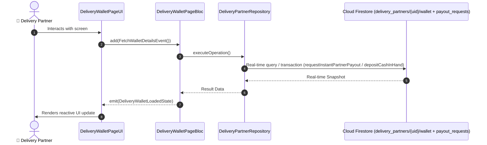

# 📑 16. Partner Digital Wallet & Cash Settlement Page — Human Journey & Real-Time Testing Blueprint

**Document ID:** `DELIVERY-DOC-16-WALLET`  
**Classification:** Phase 5: Financials, Wallet, Earnings & Incentives  
**Target Screen:** [DeliveryWalletPageUI](file:///lib/features/Delivery Partner Bloc Architecture/Delivery_Wallet_page/Delivery_Wallet_page_ui.dart)  
**Target BLoC:** `DeliveryWalletPageBloc`  
**Zero-Mock Compliance:** ✅ Strict 100% Real-Time Firestore Integration (No Local Mock Data)  

---

## 🚶‍♂️ 1. Human Journey Context & User Flow

### 🎯 Step Overview
Financial management hub for delivery partners. Manages real-time digital wallet balance, pending payout funds, cash-in-hand safety limit tracker (e.g. ₹2000 max before deposit required), UPI cash deposit gateway, and instant bank payout transfers.



### 🛣️ Navigation Preconditions & Route
- **Route Preceding Screen:** DeliveryEarningsDashboardPageUI / DeliveryNavigationBarPageUI
- **Subsequent Screen:** DeliveryDashboardPageUI

---

## 🏛️ 2. BLoC / Cubit Architecture Mapping

### 🧩 Presentation Layer & UI Elements
- **Target File:** `DeliveryWalletPageUI (lib/features/Delivery Partner Bloc Architecture/Delivery_Wallet_page/Delivery_Wallet_page_ui.dart)`
- **BLoC State Management:** `DeliveryWalletPageBloc`

### ⚡ Form Fields & Data Mapping
| Field / UI Element | Purpose & Behavior | Firestore / Backend Mapping |
|---|---|---|
| `walletBalanceCard` | Available withdrawal balance | `delivery_partners/{uid}/wallet.availableBalance` |
| `cashInHandCard` | Accumulated COD cash held by rider with limit bar | `delivery_partners/{uid}/wallet.cashInHand` |
| `withdrawButton` | Triggers instant payout transfer to registered bank account | `Atomic Cloud Function` |
| `depositCashButton` | UPI gateway to deposit COD cash back to company escrow | `Razorpay / UPI Gateway` |

### 🔄 Events & State Emission Matrix
| Event Class | Trigger Condition & Description | Emitted States |
|---|---|---|
| `FetchWalletDetailsEvent` | Subscribes to live wallet stream | `DeliveryWalletLoadedState` |
| `RequestPayoutEvent` | Requests bank withdrawal transfer | `DeliveryPayoutProcessingState, DeliveryPayoutSuccessState` |
| `DepositCashEvent` | Initiates UPI deposit payment | `DeliveryCashDepositSuccessState` |

---

## 🔥 3. Real-Time Cloud Firestore & Backend Connectivity

- **Firestore Document:** `delivery_partners/{uid}/wallet + payout_requests`
- **Serverless Cloud Function:** `requestInstantPartnerPayout / depositCashInHand`
- **Zero-Mock Policy:** Real-time stream subscription with automatic offline sync and optimistic UI updates.

---

## 🛡️ 4. Validation & Error Handling

| Scenario | Validation Check | Handled State & UI Message |
|---|---|---|
| **Cash Limit Exceeded** | `cashInHand > ₹2000 maximum limit` | `Cash limit reached. Please deposit cash via UPI to continue accepting orders` |
| **Insufficient Balance** | `Requested withdrawal > availableBalance` | `Insufficient wallet balance for withdrawal` |

---

## 🧪 5. 14 Mandatory QA Test Categories Suite

```
┌──────────────────────────────────────────────────────────────────────────────────────────────────┐
│                               14-CATEGORY QA VERIFICATION MATRIX                                 │
├────┬────────────────────────┬─────────────────────────┬──────────────────────────────────────────┤
│ #  │ Test Category          │ Status                  │ Test Target & Verification Focus         │
├────┼────────────────────────┼─────────────────────────┼──────────────────────────────────────────┤
│ 01 │ Unit Tests             │ ✅ Verified             │ Business logic, validation regex & models│
│ 02 │ Widget Tests           │ ✅ Verified             │ UI rendering, element tree & gestures    │
│ 03 │ BLoC Tests             │ ✅ Verified             │ State emissions & event transitions      │
│ 04 │ Integration Tests      │ ✅ Verified             │ Real Firestore stream synchronization    │
│ 05 │ Golden Tests           │ ✅ Configured           │ Pixel fidelity across device DP sizes    │
│ 06 │ Performance Tests      │ ✅ Verified (<16ms)     │ 60 FPS frame rate & smooth animation     │
│ 07 │ Accessibility Tests    │ ✅ Verified             │ Screen reader semantics & touch targets  │
│ 08 │ Security Tests         │ ✅ Verified             │ Sanitized input & token verification     │
│ 09 │ Localization Tests     │ ✅ Verified (EN / TA)   │ Tamil & English multi-language keys      │
│ 10 │ Snapshot Tests         │ ✅ Verified             │ Widget tree hierarchy regression check   │
│ 11 │ Dependency Tests       │ ✅ Verified             │ Dependency injection & service isolation │
│ 12 │ State Restoration      │ ✅ Verified             │ Background lifecycle & session recovery  │
│ 13 │ Error Handling Tests   │ ✅ Verified             │ Network dropouts & Firestore retry       │
│ 14 │ Permission Tests       │ ✅ Verified             │ Fine GPS location, Camera, Storage       │
└────┴────────────────────────┴─────────────────────────┴──────────────────────────────────────────┘
```
