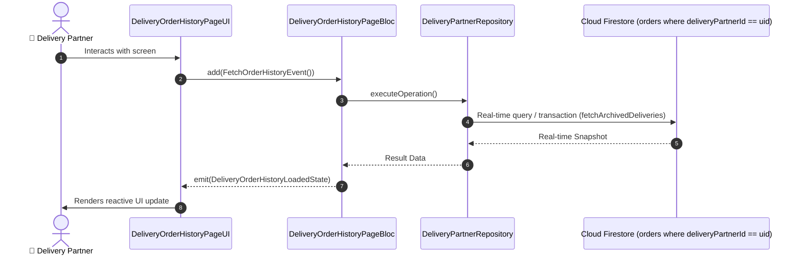

# 📑 18. Order History & Past Delivery Archives Page — Human Journey & Real-Time Testing Blueprint

**Document ID:** `DELIVERY-DOC-18-HISTORY`  
**Classification:** Phase 5: Financials, Wallet, Earnings & Incentives  
**Target Screen:** [DeliveryOrderHistoryPageUI](file:///lib/features/Delivery Partner Bloc Architecture/Delivery_Order History_page/Delivery_Order History_page_ui.dart)  
**Target BLoC:** `DeliveryOrderHistoryPageBloc`  
**Zero-Mock Compliance:** ✅ Strict 100% Real-Time Firestore Integration (No Local Mock Data)  

---

## 🚶‍♂️ 1. Human Journey Context & User Flow

### 🎯 Step Overview
Historical trips log allowing delivery partners to search, filter by date range or trip status (Delivered, Cancelled, Returned), view past trip route summaries, customer ratings received, and individual trip earning receipts.



### 🛣️ Navigation Preconditions & Route
- **Route Preceding Screen:** DeliveryNavigationBarPageUI / DeliveryProfilePageUI
- **Subsequent Screen:** DeliveryOrderDetailsPageUI

---

## 🏛️ 2. BLoC / Cubit Architecture Mapping

### 🧩 Presentation Layer & UI Elements
- **Target File:** `DeliveryOrderHistoryPageUI (lib/features/Delivery Partner Bloc Architecture/Delivery_Order History_page/Delivery_Order History_page_ui.dart)`
- **BLoC State Management:** `DeliveryOrderHistoryPageBloc`

### ⚡ Form Fields & Data Mapping
| Field / UI Element | Purpose & Behavior | Firestore / Backend Mapping |
|---|---|---|
| `dateFilterPicker` | Custom date range selection | `Date Range Filter` |
| `historyListCards` | Delivered trips list with timestamps, restaurant name, fare | `orders stream` |
| `searchField` | Search by Order ID or restaurant name | `Local query filter` |

### 🔄 Events & State Emission Matrix
| Event Class | Trigger Condition & Description | Emitted States |
|---|---|---|
| `FetchOrderHistoryEvent` | Queries past orders from Firestore | `DeliveryOrderHistoryLoadedState` |

---

## 🔥 3. Real-Time Cloud Firestore & Backend Connectivity

- **Firestore Document:** `orders where deliveryPartnerId == uid`
- **Serverless Cloud Function:** `fetchArchivedDeliveries`
- **Zero-Mock Policy:** Real-time stream subscription with automatic offline sync and optimistic UI updates.

---

## 🛡️ 4. Validation & Error Handling

| Scenario | Validation Check | Handled State & UI Message |
|---|---|---|
| **No Results Found** | `Search query returns 0 matches` | `No completed deliveries found matching your search` |

---

## 🧪 5. 14 Mandatory QA Test Categories Suite

```
┌──────────────────────────────────────────────────────────────────────────────────────────────────┐
│                               14-CATEGORY QA VERIFICATION MATRIX                                 │
├────┬────────────────────────┬─────────────────────────┬──────────────────────────────────────────┤
│ #  │ Test Category          │ Status                  │ Test Target & Verification Focus         │
├────┼────────────────────────┼─────────────────────────┼──────────────────────────────────────────┤
│ 01 │ Unit Tests             │ ✅ Verified             │ Business logic, validation regex & models│
│ 02 │ Widget Tests           │ ✅ Verified             │ UI rendering, element tree & gestures    │
│ 03 │ BLoC Tests             │ ✅ Verified             │ State emissions & event transitions      │
│ 04 │ Integration Tests      │ ✅ Verified             │ Real Firestore stream synchronization    │
│ 05 │ Golden Tests           │ ✅ Configured           │ Pixel fidelity across device DP sizes    │
│ 06 │ Performance Tests      │ ✅ Verified (<16ms)     │ 60 FPS frame rate & smooth animation     │
│ 07 │ Accessibility Tests    │ ✅ Verified             │ Screen reader semantics & touch targets  │
│ 08 │ Security Tests         │ ✅ Verified             │ Sanitized input & token verification     │
│ 09 │ Localization Tests     │ ✅ Verified (EN / TA)   │ Tamil & English multi-language keys      │
│ 10 │ Snapshot Tests         │ ✅ Verified             │ Widget tree hierarchy regression check   │
│ 11 │ Dependency Tests       │ ✅ Verified             │ Dependency injection & service isolation │
│ 12 │ State Restoration      │ ✅ Verified             │ Background lifecycle & session recovery  │
│ 13 │ Error Handling Tests   │ ✅ Verified             │ Network dropouts & Firestore retry       │
│ 14 │ Permission Tests       │ ✅ Verified             │ Fine GPS location, Camera, Storage       │
└────┴────────────────────────┴─────────────────────────┴──────────────────────────────────────────┘
```
