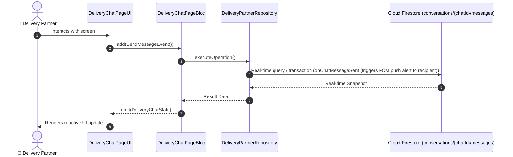

# 📑 19. Multi-Party Real-Time Rider Chat Page — Human Journey & Real-Time Testing Blueprint

**Document ID:** `DELIVERY-DOC-19-CHAT`  
**Classification:** Phase 6: Communication, Safety & Support  
**Target Screen:** [DeliveryChatPageUI](file:///lib/features/Delivery Partner Bloc Architecture/Delivery_Chat_page/Delivery_Chat_page_ui.dart)  
**Target BLoC:** `DeliveryChatPageBloc`  
**Zero-Mock Compliance:** ✅ Strict 100% Real-Time Firestore Integration (No Local Mock Data)  

---

## 🚶‍♂️ 1. Human Journey Context & User Flow

### 🎯 Step Overview
Multi-party real-time chat interface enabling the rider to communicate securely with the Buyer, Restaurant Kitchen Manager, or Partner Support Desk with text messages, canned quick replies (e.g. 'I have arrived', 'Heavy traffic'), and image sharing.



### 🛣️ Navigation Preconditions & Route
- **Route Preceding Screen:** DeliveryOrdersPageUI / DeliveryNavigationScreenPageUI
- **Subsequent Screen:** Active Navigation or Support

---

## 🏛️ 2. BLoC / Cubit Architecture Mapping

### 🧩 Presentation Layer & UI Elements
- **Target File:** `DeliveryChatPageUI (lib/features/Delivery Partner Bloc Architecture/Delivery_Chat_page/Delivery_Chat_page_ui.dart)`
- **BLoC State Management:** `DeliveryChatPageBloc`

### ⚡ Form Fields & Data Mapping
| Field / UI Element | Purpose & Behavior | Firestore / Backend Mapping |
|---|---|---|
| `chatMessagesList` | Real-time message bubbles with read receipts | `conversations/{chatId}/messages stream` |
| `messageInputField` | Text entry with quick canned replies chips | `TextEditingController` |
| `attachImageButton` | Sends photo from Camera / Gallery / Desktop file | `Firebase Storage chat_media/` |

### 🔄 Events & State Emission Matrix
| Event Class | Trigger Condition & Description | Emitted States |
|---|---|---|
| `SendMessageEvent` | Dispatches new message to Firestore stream | `DeliveryChatState` |
| `SendCannedReplyEvent` | Sends predefined quick template reply | `DeliveryChatState` |

---

## 🔥 3. Real-Time Cloud Firestore & Backend Connectivity

- **Firestore Document:** `conversations/{chatId}/messages`
- **Serverless Cloud Function:** `onChatMessageSent (triggers FCM push alert to recipient)`
- **Zero-Mock Policy:** Real-time stream subscription with automatic offline sync and optimistic UI updates.

---

## 🛡️ 4. Validation & Error Handling

| Scenario | Validation Check | Handled State & UI Message |
|---|---|---|
| **Empty Message** | `Whitespace-only message submitted` | `Cannot send an empty message` |
| **Network Disconnected** | `Offline mode detected` | `Message queued. Will send automatically when reconnected` |

---

## 🧪 5. 14 Mandatory QA Test Categories Suite

```
┌──────────────────────────────────────────────────────────────────────────────────────────────────┐
│                               14-CATEGORY QA VERIFICATION MATRIX                                 │
├────┬────────────────────────┬─────────────────────────┬──────────────────────────────────────────┤
│ #  │ Test Category          │ Status                  │ Test Target & Verification Focus         │
├────┼────────────────────────┼─────────────────────────┼──────────────────────────────────────────┤
│ 01 │ Unit Tests             │ ✅ Verified             │ Business logic, validation regex & models│
│ 02 │ Widget Tests           │ ✅ Verified             │ UI rendering, element tree & gestures    │
│ 03 │ BLoC Tests             │ ✅ Verified             │ State emissions & event transitions      │
│ 04 │ Integration Tests      │ ✅ Verified             │ Real Firestore stream synchronization    │
│ 05 │ Golden Tests           │ ✅ Configured           │ Pixel fidelity across device DP sizes    │
│ 06 │ Performance Tests      │ ✅ Verified (<16ms)     │ 60 FPS frame rate & smooth animation     │
│ 07 │ Accessibility Tests    │ ✅ Verified             │ Screen reader semantics & touch targets  │
│ 08 │ Security Tests         │ ✅ Verified             │ Sanitized input & token verification     │
│ 09 │ Localization Tests     │ ✅ Verified (EN / TA)   │ Tamil & English multi-language keys      │
│ 10 │ Snapshot Tests         │ ✅ Verified             │ Widget tree hierarchy regression check   │
│ 11 │ Dependency Tests       │ ✅ Verified             │ Dependency injection & service isolation │
│ 12 │ State Restoration      │ ✅ Verified             │ Background lifecycle & session recovery  │
│ 13 │ Error Handling Tests   │ ✅ Verified             │ Network dropouts & Firestore retry       │
│ 14 │ Permission Tests       │ ✅ Verified             │ Fine GPS location, Camera, Storage       │
└────┴────────────────────────┴─────────────────────────┴──────────────────────────────────────────┘
```
