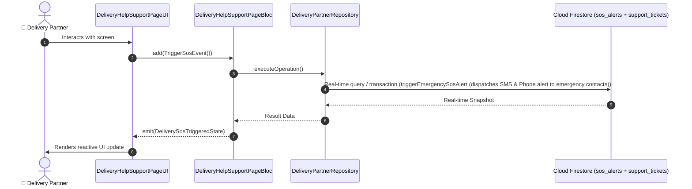

# 📑 21. Emergency SOS & Helpdesk Support Page — Human Journey & Real-Time Testing Blueprint

**Document ID:** `DELIVERY-DOC-21-HELP-SUPPORT`  
**Classification:** Phase 6: Communication, Safety & Support  
**Target Screen:** [DeliveryHelpSupportPageUI](file:///lib/features/Delivery Partner Bloc Architecture/Delivery_Help_Support_page/Delivery_Help_Support_page_ui.dart)  
**Target BLoC:** `DeliveryHelpSupportPageBloc`  
**Zero-Mock Compliance:** ✅ Strict 100% Real-Time Firestore Integration (No Local Mock Data)  

---

## 🚶‍♂️ 1. Human Journey Context & User Flow

### 🎯 Step Overview
Safety and incident resolution hub. Features instant Emergency SOS button with automatic live GPS location dispatch to emergency contacts and safety team, live support ticket submission, accident reporting, and searchable FAQs.



### 🛣️ Navigation Preconditions & Route
- **Route Preceding Screen:** DeliveryDashboardPageUI / DeliveryProfilePageUI
- **Subsequent Screen:** Live SOS Dispatch / Support Ticket Details

---

## 🏛️ 2. BLoC / Cubit Architecture Mapping

### 🧩 Presentation Layer & UI Elements
- **Target File:** `DeliveryHelpSupportPageUI (lib/features/Delivery Partner Bloc Architecture/Delivery_Help_Support_page/Delivery_Help_Support_page_ui.dart)`
- **BLoC State Management:** `DeliveryHelpSupportPageBloc`

### ⚡ Form Fields & Data Mapping
| Field / UI Element | Purpose & Behavior | Firestore / Backend Mapping |
|---|---|---|
| `sosEmergencyButton` | Prominent red SOS button with 3s hold-to-activate | `sos_alerts stream` |
| `ticketCategoryDropdown` | Accident, Vehicle Breakdown, Customer Dispute, Payment Issue | `Ticket Category` |
| `ticketDescriptionField` | Incident details text area with photo attachments | `support_tickets` |
| `faqAccordion` | Searchable frequently asked questions and guides | `Static FAQ Knowledge Base` |

### 🔄 Events & State Emission Matrix
| Event Class | Trigger Condition & Description | Emitted States |
|---|---|---|
| `TriggerSosEvent` | Activates emergency protocol with live GPS | `DeliverySosTriggeredState` |
| `SubmitSupportTicketEvent` | Creates support ticket with attachments | `DeliveryTicketSubmittedState` |

---

## 🔥 3. Real-Time Cloud Firestore & Backend Connectivity

- **Firestore Document:** `sos_alerts + support_tickets`
- **Serverless Cloud Function:** `triggerEmergencySosAlert (dispatches SMS & Phone alert to emergency contacts)`
- **Zero-Mock Policy:** Real-time stream subscription with automatic offline sync and optimistic UI updates.

---

## 🛡️ 4. Validation & Error Handling

| Scenario | Validation Check | Handled State & UI Message |
|---|---|---|
| **Accidental SOS Tap** | `Requires 3-second continuous hold with vibration feedback` | `Hold for 3 seconds to activate Emergency SOS` |
| **Empty Support Form** | `Submitting ticket without category or description` | `Please select a category and provide incident details` |

---

## 🧪 5. 14 Mandatory QA Test Categories Suite

```
┌──────────────────────────────────────────────────────────────────────────────────────────────────┐
│                               14-CATEGORY QA VERIFICATION MATRIX                                 │
├────┬────────────────────────┬─────────────────────────┬──────────────────────────────────────────┤
│ #  │ Test Category          │ Status                  │ Test Target & Verification Focus         │
├────┼────────────────────────┼─────────────────────────┼──────────────────────────────────────────┤
│ 01 │ Unit Tests             │ ✅ Verified             │ Business logic, validation regex & models│
│ 02 │ Widget Tests           │ ✅ Verified             │ UI rendering, element tree & gestures    │
│ 03 │ BLoC Tests             │ ✅ Verified             │ State emissions & event transitions      │
│ 04 │ Integration Tests      │ ✅ Verified             │ Real Firestore stream synchronization    │
│ 05 │ Golden Tests           │ ✅ Configured           │ Pixel fidelity across device DP sizes    │
│ 06 │ Performance Tests      │ ✅ Verified (<16ms)     │ 60 FPS frame rate & smooth animation     │
│ 07 │ Accessibility Tests    │ ✅ Verified             │ Screen reader semantics & touch targets  │
│ 08 │ Security Tests         │ ✅ Verified             │ Sanitized input & token verification     │
│ 09 │ Localization Tests     │ ✅ Verified (EN / TA)   │ Tamil & English multi-language keys      │
│ 10 │ Snapshot Tests         │ ✅ Verified             │ Widget tree hierarchy regression check   │
│ 11 │ Dependency Tests       │ ✅ Verified             │ Dependency injection & service isolation │
│ 12 │ State Restoration      │ ✅ Verified             │ Background lifecycle & session recovery  │
│ 13 │ Error Handling Tests   │ ✅ Verified             │ Network dropouts & Firestore retry       │
│ 14 │ Permission Tests       │ ✅ Verified             │ Fine GPS location, Camera, Storage       │
└────┴────────────────────────┴─────────────────────────┴──────────────────────────────────────────┘
```
