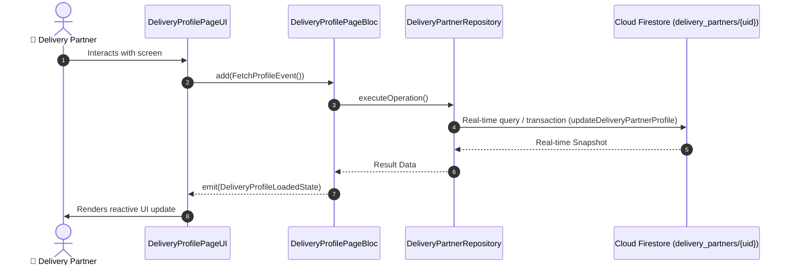

# 📑 22. Partner Profile, Vehicle & KYC Status Page — Human Journey & Real-Time Testing Blueprint

**Document ID:** `DELIVERY-DOC-22-PROFILE`  
**Classification:** Phase 7: Profile, Vehicle & App Settings  
**Target Screen:** [DeliveryProfilePageUI](file:///lib/features/Delivery Partner Bloc Architecture/Delivery_Profile_page/Delivery_Profile_page_ui.dart)  
**Target BLoC:** `DeliveryProfilePageBloc / DeliveryRatingBloc`  
**Zero-Mock Compliance:** ✅ Strict 100% Real-Time Firestore Integration (No Local Mock Data)  

---

## 🚶‍♂️ 1. Human Journey Context & User Flow

### 🎯 Step Overview
Partner profile management interface displaying driver avatar, verified badges, overall star rating and customer compliments, vehicle details (RC, license plate), KYC document expiry status alerts (e.g. DL expiring soon), registered bank account details, and address locator.



### 🛣️ Navigation Preconditions & Route
- **Route Preceding Screen:** DeliveryNavigationBarPageUI
- **Subsequent Screen:** DeliverySettingsPageUI / DeliveryGoogleAddressSearchDialog

---

## 🏛️ 2. BLoC / Cubit Architecture Mapping

### 🧩 Presentation Layer & UI Elements
- **Target File:** `DeliveryProfilePageUI (lib/features/Delivery Partner Bloc Architecture/Delivery_Profile_page/Delivery_Profile_page_ui.dart)`
- **BLoC State Management:** `DeliveryProfilePageBloc / DeliveryRatingBloc`

### ⚡ Form Fields & Data Mapping
| Field / UI Element | Purpose & Behavior | Firestore / Backend Mapping |
|---|---|---|
| `avatarSection` | Driver photo with cross-platform upload (Camera/Gallery/Desktop) | `Firebase Storage driver_avatars/` |
| `driverDetailsCard` | Full Name, Phone, Email, Blood Group, Emergency Contact | `delivery_partners/{uid}` |
| `vehicleDetailsCard` | Vehicle Model, Plate Number, Insurance & RC Status | `delivery_partners/{uid}/vehicle_info` |
| `kycDocumentStatusList` | Driving License, PAN, Aadhaar status with expiry alerts | `delivery_partners/{uid}/kyc_documents` |
| `bankAccountCard` | Masked bank account number, IFSC, UPI ID | `delivery_partners/{uid}/bank_details` |

### 🔄 Events & State Emission Matrix
| Event Class | Trigger Condition & Description | Emitted States |
|---|---|---|
| `FetchProfileEvent` | Subscribes to live partner profile document | `DeliveryProfileLoadedState` |
| `UpdateProfileDetailsEvent` | Updates profile information and photo | `DeliveryProfileUpdatedState` |

---

## 🔥 3. Real-Time Cloud Firestore & Backend Connectivity

- **Firestore Document:** `delivery_partners/{uid}`
- **Serverless Cloud Function:** `updateDeliveryPartnerProfile`
- **Zero-Mock Policy:** Real-time stream subscription with automatic offline sync and optimistic UI updates.

---

## 🛡️ 4. Validation & Error Handling

| Scenario | Validation Check | Handled State & UI Message |
|---|---|---|
| **Expiring License Alert** | `Driving license expiry < 30 days` | `Your driving license expires in X days. Please upload renewed document` |

---

## 🧪 5. 14 Mandatory QA Test Categories Suite

```
┌──────────────────────────────────────────────────────────────────────────────────────────────────┐
│                               14-CATEGORY QA VERIFICATION MATRIX                                 │
├────┬────────────────────────┬─────────────────────────┬──────────────────────────────────────────┤
│ #  │ Test Category          │ Status                  │ Test Target & Verification Focus         │
├────┼────────────────────────┼─────────────────────────┼──────────────────────────────────────────┤
│ 01 │ Unit Tests             │ ✅ Verified             │ Business logic, validation regex & models│
│ 02 │ Widget Tests           │ ✅ Verified             │ UI rendering, element tree & gestures    │
│ 03 │ BLoC Tests             │ ✅ Verified             │ State emissions & event transitions      │
│ 04 │ Integration Tests      │ ✅ Verified             │ Real Firestore stream synchronization    │
│ 05 │ Golden Tests           │ ✅ Configured           │ Pixel fidelity across device DP sizes    │
│ 06 │ Performance Tests      │ ✅ Verified (<16ms)     │ 60 FPS frame rate & smooth animation     │
│ 07 │ Accessibility Tests    │ ✅ Verified             │ Screen reader semantics & touch targets  │
│ 08 │ Security Tests         │ ✅ Verified             │ Sanitized input & token verification     │
│ 09 │ Localization Tests     │ ✅ Verified (EN / TA)   │ Tamil & English multi-language keys      │
│ 10 │ Snapshot Tests         │ ✅ Verified             │ Widget tree hierarchy regression check   │
│ 11 │ Dependency Tests       │ ✅ Verified             │ Dependency injection & service isolation │
│ 12 │ State Restoration      │ ✅ Verified             │ Background lifecycle & session recovery  │
│ 13 │ Error Handling Tests   │ ✅ Verified             │ Network dropouts & Firestore retry       │
│ 14 │ Permission Tests       │ ✅ Verified             │ Fine GPS location, Camera, Storage       │
└────┴────────────────────────┴─────────────────────────┴──────────────────────────────────────────┘
```
