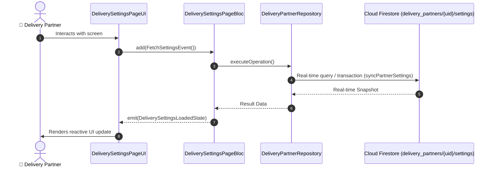

# 📑 23. App Settings, Navigation Preferences & Audio Alerts Page — Human Journey & Real-Time Testing Blueprint

**Document ID:** `DELIVERY-DOC-23-SETTINGS`  
**Classification:** Phase 7: Profile, Vehicle & App Settings  
**Target Screen:** [DeliverySettingsPageUI](file:///lib/features/Delivery Partner Bloc Architecture/Delivery_Settings_page/Delivery_Settings_page_ui.dart)  
**Target BLoC:** `DeliverySettingsPageBloc`  
**Zero-Mock Compliance:** ✅ Strict 100% Real-Time Firestore Integration (No Local Mock Data)  

---

## 🚶‍♂️ 1. Human Journey Context & User Flow

### 🎯 Step Overview
Comprehensive customization and configuration screen for riders. Manages preferred external navigation app (Google Maps, Waze, Apple Maps, In-App HUD), audible order alert volume and vibration patterns, voice turn guidance toggles, dark/light theme, language localization (English / Tamil), and secure logout.



### 🛣️ Navigation Preconditions & Route
- **Route Preceding Screen:** DeliveryProfilePageUI / DeliveryNavigationBarPageUI
- **Subsequent Screen:** DeliveryLoginPageUI (on Logout)

---

## 🏛️ 2. BLoC / Cubit Architecture Mapping

### 🧩 Presentation Layer & UI Elements
- **Target File:** `DeliverySettingsPageUI (lib/features/Delivery Partner Bloc Architecture/Delivery_Settings_page/Delivery_Settings_page_ui.dart)`
- **BLoC State Management:** `DeliverySettingsPageBloc`

### ⚡ Form Fields & Data Mapping
| Field / UI Element | Purpose & Behavior | Firestore / Backend Mapping |
|---|---|---|
| `navigationAppSelector` | Google Maps / Waze / Apple Maps / Internal HUD | `settings.defaultNavigationApp` |
| `soundAlertsToggle` | Looping ringtone volume and vibration toggles | `settings.audioAlerts` |
| `voiceGuidanceToggle` | Voice navigation prompts toggle | `settings.voiceGuidance` |
| `languageSelector` | English (EN) / Tamil (TA) language switch | `settings.locale` |
| `darkModeToggle` | Dark / Light / System theme switch | `settings.themeMode` |
| `logoutButton` | Clears auth tokens and signs out securely | `AppLogoutService` |

### 🔄 Events & State Emission Matrix
| Event Class | Trigger Condition & Description | Emitted States |
|---|---|---|
| `FetchSettingsEvent` | Loads partner settings from Firestore | `DeliverySettingsLoadedState` |
| `UpdateSettingEvent` | Updates individual preference key-value pair | `DeliverySettingsUpdatedState` |
| `LogoutEvent` | Executes clean session logout | `DeliveryLoggedOutState` |

---

## 🔥 3. Real-Time Cloud Firestore & Backend Connectivity

- **Firestore Document:** `delivery_partners/{uid}/settings`
- **Serverless Cloud Function:** `syncPartnerSettings`
- **Zero-Mock Policy:** Real-time stream subscription with automatic offline sync and optimistic UI updates.

---

## 🛡️ 4. Validation & Error Handling

| Scenario | Validation Check | Handled State & UI Message |
|---|---|---|
| **Active Order Logout Lock** | `Rider attempts to log out with an active trip in progress` | `Cannot log out while an active delivery is in progress` |

---

## 🧪 5. 14 Mandatory QA Test Categories Suite

```
┌──────────────────────────────────────────────────────────────────────────────────────────────────┐
│                               14-CATEGORY QA VERIFICATION MATRIX                                 │
├────┬────────────────────────┬─────────────────────────┬──────────────────────────────────────────┤
│ #  │ Test Category          │ Status                  │ Test Target & Verification Focus         │
├────┼────────────────────────┼─────────────────────────┼──────────────────────────────────────────┤
│ 01 │ Unit Tests             │ ✅ Verified             │ Business logic, validation regex & models│
│ 02 │ Widget Tests           │ ✅ Verified             │ UI rendering, element tree & gestures    │
│ 03 │ BLoC Tests             │ ✅ Verified             │ State emissions & event transitions      │
│ 04 │ Integration Tests      │ ✅ Verified             │ Real Firestore stream synchronization    │
│ 05 │ Golden Tests           │ ✅ Configured           │ Pixel fidelity across device DP sizes    │
│ 06 │ Performance Tests      │ ✅ Verified (<16ms)     │ 60 FPS frame rate & smooth animation     │
│ 07 │ Accessibility Tests    │ ✅ Verified             │ Screen reader semantics & touch targets  │
│ 08 │ Security Tests         │ ✅ Verified             │ Sanitized input & token verification     │
│ 09 │ Localization Tests     │ ✅ Verified (EN / TA)   │ Tamil & English multi-language keys      │
│ 10 │ Snapshot Tests         │ ✅ Verified             │ Widget tree hierarchy regression check   │
│ 11 │ Dependency Tests       │ ✅ Verified             │ Dependency injection & service isolation │
│ 12 │ State Restoration      │ ✅ Verified             │ Background lifecycle & session recovery  │
│ 13 │ Error Handling Tests   │ ✅ Verified             │ Network dropouts & Firestore retry       │
│ 14 │ Permission Tests       │ ✅ Verified             │ Fine GPS location, Camera, Storage       │
└────┴────────────────────────┴─────────────────────────┴──────────────────────────────────────────┘
```
