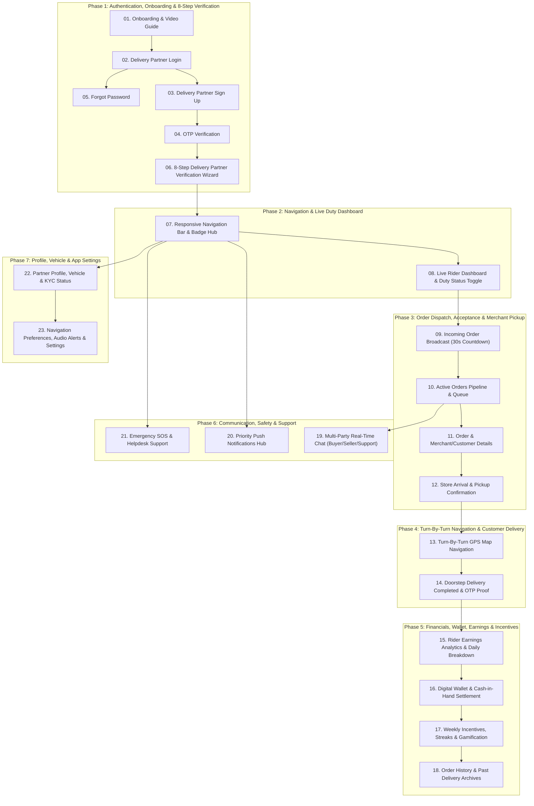

# 🛵 Delivery Partner BLoC Architecture — Master Human Journey & Real-Time Testing Roadmap

**Classification:** Enterprise Architecture, Human Journey Mapping & QA Test Matrix  
**Target Domain:** Delivery Partner (Rider / Courier / Logistics) BLoC Architecture  
**Database Engine:** Google Cloud Firestore (`asia-south1`) | **Backend Functions:** Firebase Cloud Functions  
**Zero-Mock Compliance:** ✅ Strict 100% Real-Time Firestore Integration (No Local Fallbacks / Hardcoded Stubs)  
**Total Delivery Partner Modules:** 23 Feature Modules Across 7 Chronological Journey Phases  

---

## 🧭 1. Executive Human Journey Map (The Delivery Partner Experience Lifecycle)

A professional delivery partner / rider interacts with the food delivery platform in a strictly defined chronological lifecycle (Human Journey). Every screen and state machine serves a distinct operational purpose in this journey:



---

## 📑 2. Complete 23-Module Master Inventory & Navigation Matrix

| # | Feature Module | Directory Location | Primary UI Widget | Primary BLoC Class | Real-Time Firestore Source | Detailed Journey Guide |
|---|---|---|---|---|---|---|
| **01** | **Onboarding Guide** | `Delivery_onboarding_page/` | [DeliveryOnboardingPageUI](file:///d:/Flutter_Project/food_delivery_app/lib/features/Delivery%20Partner%20Bloc%20Architecture/Delivery_onboarding_page/Delivery_onboarding_page_ui.dart) | [DeliveryOnboardingPageBloc](file:///d:/Flutter_Project/food_delivery_app/lib/features/Delivery%20Partner%20Bloc%20Architecture/Delivery_onboarding_page/Delivery_onboarding_page_bloc.dart) | Firebase Auth State Listener | [01_DELIVERY_ONBOARDING_PAGE.md](file:///d:/Flutter_Project/food_delivery_app/md_files/06_Delivery_Partner_Human_Journey_And_Testing/01_Auth_And_Onboarding/01_DELIVERY_ONBOARDING_PAGE.md) |
| **02** | **Rider Login** | `Delivery_Login Page/` | [DeliveryLoginPageUI](file:///d:/Flutter_Project/food_delivery_app/lib/features/Delivery%20Partner%20Bloc%20Architecture/Delivery_Login%20Page/Delivery_Login%20Page_ui.dart) | [DeliveryLoginPageBloc](file:///d:/Flutter_Project/food_delivery_app/lib/features/Delivery%20Partner%20Bloc%20Architecture/Delivery_Login%20Page/Delivery_Login%20Page_bloc.dart) | `delivery_partners/{uid}` + Auth | [02_DELIVERY_LOGIN_PAGE.md](file:///d:/Flutter_Project/food_delivery_app/md_files/06_Delivery_Partner_Human_Journey_And_Testing/01_Auth_And_Onboarding/02_DELIVERY_LOGIN_PAGE.md) |
| **03** | **Rider Sign Up** | `Delivery_Sign_Up_page/` | [DeliverySignUpPageUI](file:///d:/Flutter_Project/food_delivery_app/lib/features/Delivery%20Partner%20Bloc%20Architecture/Delivery_Sign_Up_page/Delivery_Sign_Up_page_ui.dart) | [DeliverySignUpPageBloc](file:///d:/Flutter_Project/food_delivery_app/lib/features/Delivery%20Partner%20Bloc%20Architecture/Delivery_Sign_Up_page/Delivery_Sign_Up_page_bloc.dart) | `delivery_partners/{uid}` (Atomic) | [03_DELIVERY_SIGN_UP_PAGE.md](file:///d:/Flutter_Project/food_delivery_app/md_files/06_Delivery_Partner_Human_Journey_And_Testing/01_Auth_And_Onboarding/03_DELIVERY_SIGN_UP_PAGE.md) |
| **04** | **OTP Verification** | `Delivery_OTP_Verification_page/` | [DeliveryOTPVerificationPageUI](file:///d:/Flutter_Project/food_delivery_app/lib/features/Delivery%20Partner%20Bloc%20Architecture/Delivery_OTP_Verification_page/Delivery_OTP_Verification_page_ui.dart) | [DeliveryOTPVerificationPageBloc](file:///d:/Flutter_Project/food_delivery_app/lib/features/Delivery%20Partner%20Bloc%20Architecture/Delivery_OTP_Verification_page/Delivery_OTP_Verification_page_bloc.dart) | Firebase Phone Auth Credential | [04_DELIVERY_OTP_VERIFICATION_PAGE.md](file:///d:/Flutter_Project/food_delivery_app/md_files/06_Delivery_Partner_Human_Journey_And_Testing/01_Auth_And_Onboarding/04_DELIVERY_OTP_VERIFICATION_PAGE.md) |
| **05** | **Forgot Password** | `Delivery_Forgot_Password_page/` | [DeliveryForgotPasswordPageUI](file:///d:/Flutter_Project/food_delivery_app/lib/features/Delivery%20Partner%20Bloc%20Architecture/Delivery_Forgot_Password_page/Delivery_Forgot_Password_page_ui.dart) | [DeliveryForgotPasswordPageBloc](file:///d:/Flutter_Project/food_delivery_app/lib/features/Delivery%20Partner%20Bloc%20Architecture/Delivery_Forgot_Password_page/Delivery_Forgot_Password_page_bloc.dart) | Firebase Auth Password Reset | [05_DELIVERY_FORGOT_PASSWORD_PAGE.md](file:///d:/Flutter_Project/food_delivery_app/md_files/06_Delivery_Partner_Human_Journey_And_Testing/01_Auth_And_Onboarding/05_DELIVERY_FORGOT_PASSWORD_PAGE.md) |
| **06** | **8-Step Verification Wizard** | `Delivery_onboarding_verification_page/` | [DeliveryOnboardingVerificationPage](file:///d:/Flutter_Project/food_delivery_app/lib/features/Delivery%20Partner%20Bloc%20Architecture/Delivery_onboarding_verification_page/delivery_onboarding_verification_ui.dart) | [DeliveryOnboardingVerificationBloc](file:///d:/Flutter_Project/food_delivery_app/lib/features/Delivery%20Partner%20Bloc%20Architecture/Delivery_onboarding_verification_page/delivery_onboarding_verification_bloc.dart) | `delivery_partners/{uid}` (8-Step KYC) | [06_DELIVERY_ONBOARDING_VERIFICATION_WIZARD_PAGE.md](file:///d:/Flutter_Project/food_delivery_app/md_files/06_Delivery_Partner_Human_Journey_And_Testing/01_Auth_And_Onboarding/06_DELIVERY_ONBOARDING_VERIFICATION_WIZARD_PAGE.md) |
| **07** | **Navigation Shell & Badges** | `Delivery_NavigationBar_page/` | [DeliveryNavigationBarPageUI](file:///d:/Flutter_Project/food_delivery_app/lib/features/Delivery%20Partner%20Bloc%20Architecture/Delivery_NavigationBar_page/Delivery_NavigationBar_page_ui.dart) | [DeliveryNavigationBarPageBloc](file:///d:/Flutter_Project/food_delivery_app/lib/features/Delivery%20Partner%20Bloc%20Architecture/Delivery_NavigationBar_page/Delivery_NavigationBar_page_bloc.dart) | Real-time Trip / Alert Badges | [07_DELIVERY_NAVIGATION_BAR_VIEW.md](file:///d:/Flutter_Project/food_delivery_app/md_files/06_Delivery_Partner_Human_Journey_And_Testing/02_Navigation_And_Duty_Dashboard/07_DELIVERY_NAVIGATION_BAR_VIEW.md) |
| **08** | **Live Duty Dashboard** | `Delivery_Dashboard_page/` | [DeliveryDashboardPageUI](file:///d:/Flutter_Project/food_delivery_app/lib/features/Delivery%20Partner%20Bloc%20Architecture/Delivery_Dashboard_page/Delivery_Dashboard_page_ui.dart) | [DeliveryDashboardPageBloc](file:///d:/Flutter_Project/food_delivery_app/lib/features/Delivery%20Partner%20Bloc%20Architecture/Delivery_Dashboard_page/Delivery_Dashboard_page_bloc.dart)<br>[AvailabilityCubit](file:///d:/Flutter_Project/food_delivery_app/lib/features/Delivery%20Partner%20Bloc%20Architecture/Delivery_Dashboard_page/availability_cubit.dart) | `delivery_partners/{uid}` + Active Shifts | [08_DELIVERY_DASHBOARD_PAGE.md](file:///d:/Flutter_Project/food_delivery_app/md_files/06_Delivery_Partner_Human_Journey_And_Testing/02_Navigation_And_Duty_Dashboard/08_DELIVERY_DASHBOARD_PAGE.md) |
| **09** | **Incoming Order Alert** | `Delivery_Incoming_Order_page/` | [DeliveryIncomingOrderPageUI](file:///d:/Flutter_Project/food_delivery_app/lib/features/Delivery%20Partner%20Bloc%20Architecture/Delivery_Incoming_Order_page/Delivery_Incoming_Order_page_ui.dart) | [DeliveryIncomingOrderPageBloc](file:///d:/Flutter_Project/food_delivery_app/lib/features/Delivery%20Partner%20Bloc%20Architecture/Delivery_Incoming_Order_page/Delivery_Incoming_Order_page_bloc.dart) | `delivery_broadcasts` + 30s Lock | [09_DELIVERY_INCOMING_ORDER_PAGE.md](file:///d:/Flutter_Project/food_delivery_app/md_files/06_Delivery_Partner_Human_Journey_And_Testing/03_Order_Dispatch_And_Pickup/09_DELIVERY_INCOMING_ORDER_PAGE.md) |
| **10** | **Orders Pipeline** | `Delivery_Orders_page/` | [DeliveryOrdersPageUI](file:///d:/Flutter_Project/food_delivery_app/lib/features/Delivery%20Partner%20Bloc%20Architecture/Delivery_Orders_page/Delivery_Orders_page_ui.dart) | [DeliveryOrdersPageBloc](file:///d:/Flutter_Project/food_delivery_app/lib/features/Delivery%20Partner%20Bloc%20Architecture/Delivery_Orders_page/Delivery_Orders_page_bloc.dart) | `orders` where deliveryPartnerId == uid | [10_DELIVERY_ORDERS_PAGE.md](file:///d:/Flutter_Project/food_delivery_app/md_files/06_Delivery_Partner_Human_Journey_And_Testing/03_Order_Dispatch_And_Pickup/10_DELIVERY_ORDERS_PAGE.md) |
| **11** | **Order & Delivery Details** | `Delivery_Order_Details_page/` | [DeliveryOrderDetailsPageUI](file:///d:/Flutter_Project/food_delivery_app/lib/features/Delivery%20Partner%20Bloc%20Architecture/Delivery_Order_Details_page/Delivery_Order_Details_page_ui.dart) | [DeliveryOrderDetailsPageBloc](file:///d:/Flutter_Project/food_delivery_app/lib/features/Delivery%20Partner%20Bloc%20Architecture/Delivery_Order_Details_page/Delivery_Order_Details_page_bloc.dart) | `orders/{orderId}` (Full Stream) | [11_DELIVERY_ORDER_DETAILS_PAGE.md](file:///d:/Flutter_Project/food_delivery_app/md_files/06_Delivery_Partner_Human_Journey_And_Testing/03_Order_Dispatch_And_Pickup/11_DELIVERY_ORDER_DETAILS_PAGE.md) |
| **12** | **Pickup Confirmation** | `Delivery_Pickup Confirmation_page/` | [DeliveryPickupConfirmationPageUI](file:///d:/Flutter_Project/food_delivery_app/lib/features/Delivery%20Partner%20Bloc%20Architecture/Delivery_Pickup%20Confirmation_page/Delivery_Pickup%20Confirmation_page_ui.dart) | [DeliveryPickupConfirmationPageBloc](file:///d:/Flutter_Project/food_delivery_app/lib/features/Delivery%20Partner%20Bloc%20Architecture/Delivery_Pickup%20Confirmation_page/Delivery_Pickup%20Confirmation_page_bloc.dart) | Store Geofence & Merchant Verification | [12_DELIVERY_PICKUP_CONFIRMATION_PAGE.md](file:///d:/Flutter_Project/food_delivery_app/md_files/06_Delivery_Partner_Human_Journey_And_Testing/03_Order_Dispatch_And_Pickup/12_DELIVERY_PICKUP_CONFIRMATION_PAGE.md) |
| **13** | **Live GPS Navigation HUD** | `Delivery_Navigation Screen_page/` | [DeliveryNavigationScreenPageUI](file:///d:/Flutter_Project/food_delivery_app/lib/features/Delivery%20Partner%20Bloc%20Architecture/Delivery_Navigation%20Screen_page/Delivery_Navigation%20Screen_page_ui.dart) | [DeliveryNavigationScreenPageBloc](file:///d:/Flutter_Project/food_delivery_app/lib/features/Delivery%20Partner%20Bloc%20Architecture/Delivery_Navigation%20Screen_page/Delivery_Navigation%20Screen_page_bloc.dart)<br>[LiveLocationBloc](file:///d:/Flutter_Project/food_delivery_app/lib/features/Delivery%20Partner%20Bloc%20Architecture/Delivery_Navigation%20Screen_page/live_location_bloc.dart) | Device GPS & Route Polyline Stream | [13_DELIVERY_NAVIGATION_SCREEN_PAGE.md](file:///d:/Flutter_Project/food_delivery_app/md_files/06_Delivery_Partner_Human_Journey_And_Testing/04_Navigation_And_Customer_Delivery/13_DELIVERY_NAVIGATION_SCREEN_PAGE.md) |
| **14** | **Delivery Completed & OTP** | `Delivery_Delivery Completed_page/` | [DeliveryDeliveryCompletedPageUI](file:///d:/Flutter_Project/food_delivery_app/lib/features/Delivery%20Partner%20Bloc%20Architecture/Delivery_Delivery%20Completed_page/Delivery_Delivery%20Completed_page_ui.dart) | [DeliveryDeliveryCompletedPageBloc](file:///d:/Flutter_Project/food_delivery_app/lib/features/Delivery%20Partner%20Bloc%20Architecture/Delivery_Delivery%20Completed_page/Delivery_Delivery%20Completed_page_bloc.dart) | Doorstep OTP + Photo Proof + Ledger | [14_DELIVERY_COMPLETED_PAGE.md](file:///d:/Flutter_Project/food_delivery_app/md_files/06_Delivery_Partner_Human_Journey_And_Testing/04_Navigation_And_Customer_Delivery/14_DELIVERY_COMPLETED_PAGE.md) |
| **15** | **Earnings Analytics** | `Delivery_Earnings Dashboard_page/` | [DeliveryEarningsDashboardPageUI](file:///d:/Flutter_Project/food_delivery_app/lib/features/Delivery%20Partner%20Bloc%20Architecture/Delivery_Earnings%20Dashboard_page/Delivery_Earnings%20Dashboard_page_ui.dart) | [DeliveryEarningsDashboardPageBloc](file:///d:/Flutter_Project/food_delivery_app/lib/features/Delivery%20Partner%20Bloc%20Architecture/Delivery_Earnings%20Dashboard_page/Delivery_Earnings%20Dashboard_page_bloc.dart) | `delivery_partners/{uid}/earnings` | [15_DELIVERY_EARNINGS_DASHBOARD_PAGE.md](file:///d:/Flutter_Project/food_delivery_app/md_files/06_Delivery_Partner_Human_Journey_And_Testing/05_Financials_Wallet_And_Incentives/15_DELIVERY_EARNINGS_DASHBOARD_PAGE.md) |
| **16** | **Rider Wallet & Cash** | `Delivery_Wallet_page/` | [DeliveryWalletPageUI](file:///d:/Flutter_Project/food_delivery_app/lib/features/Delivery%20Partner%20Bloc%20Architecture/Delivery_Wallet_page/Delivery_Wallet_page_ui.dart) | [DeliveryWalletPageBloc](file:///d:/Flutter_Project/food_delivery_app/lib/features/Delivery%20Partner%20Bloc%20Architecture/Delivery_Wallet_page/Delivery_Wallet_page_bloc.dart) | `delivery_partners/{uid}/wallet` | [16_DELIVERY_WALLET_PAGE.md](file:///d:/Flutter_Project/food_delivery_app/md_files/06_Delivery_Partner_Human_Journey_And_Testing/05_Financials_Wallet_And_Incentives/16_DELIVERY_WALLET_PAGE.md) |
| **17** | **Incentives & Streaks** | `Delivery_Incentives Dashboard_page/` | [DeliveryIncentivesDashboardPageUI](file:///d:/Flutter_Project/food_delivery_app/lib/features/Delivery%20Partner%20Bloc%20Architecture/Delivery_Incentives%20Dashboard_page/Delivery_Incentives%20Dashboard_page_ui.dart) | [DeliveryIncentivesDashboardPageBloc](file:///d:/Flutter_Project/food_delivery_app/lib/features/Delivery%20Partner%20Bloc%20Architecture/Delivery_Incentives%20Dashboard_page/Delivery_Incentives%20Dashboard_page_bloc.dart) | `partner_incentives/{uid}` | [17_DELIVERY_INCENTIVES_DASHBOARD_PAGE.md](file:///d:/Flutter_Project/food_delivery_app/md_files/06_Delivery_Partner_Human_Journey_And_Testing/05_Financials_Wallet_And_Incentives/17_DELIVERY_INCENTIVES_DASHBOARD_PAGE.md) |
| **18** | **Order History Archive** | `Delivery_Order History_page/` | [DeliveryOrderHistoryPageUI](file:///d:/Flutter_Project/food_delivery_app/lib/features/Delivery%20Partner%20Bloc%20Architecture/Delivery_Order%20History_page/Delivery_Order%20History_page_ui.dart) | [DeliveryOrderHistoryPageBloc](file:///d:/Flutter_Project/food_delivery_app/lib/features/Delivery%20Partner%20Bloc%20Architecture/Delivery_Order%20History_page/Delivery_Order%20History_page_bloc.dart) | Past Trips Firestore Stream | [18_DELIVERY_ORDER_HISTORY_PAGE.md](file:///d:/Flutter_Project/food_delivery_app/md_files/06_Delivery_Partner_Human_Journey_And_Testing/05_Financials_Wallet_And_Incentives/18_DELIVERY_ORDER_HISTORY_PAGE.md) |
| **19** | **Real-Time Rider Chat** | `Delivery_Chat_page/` | [DeliveryChatPageUI](file:///d:/Flutter_Project/food_delivery_app/lib/features/Delivery%20Partner%20Bloc%20Architecture/Delivery_Chat_page/Delivery_Chat_page_ui.dart) | [DeliveryChatPageBloc](file:///d:/Flutter_Project/food_delivery_app/lib/features/Delivery%20Partner%20Bloc%20Architecture/Delivery_Chat_page/Delivery_Chat_page_bloc.dart) | `conversations/{chatId}/messages` | [19_DELIVERY_CHAT_PAGE.md](file:///d:/Flutter_Project/food_delivery_app/md_files/06_Delivery_Partner_Human_Journey_And_Testing/06_Communication_Safety_And_Support/19_DELIVERY_CHAT_PAGE.md) |
| **20** | **Dispatch Notifications** | `Delivery_Notifications_page/` | [DeliveryNotificationsPageUI](file:///d:/Flutter_Project/food_delivery_app/lib/features/Delivery%20Partner%20Bloc%20Architecture/Delivery_Notifications_page/Delivery_Notifications_page_ui.dart) | [DeliveryNotificationBloc](file:///d:/Flutter_Project/food_delivery_app/lib/features/Delivery%20Partner%20Bloc%20Architecture/Delivery_Notifications_page/delivery_notification_bloc.dart) | `delivery_partners/{uid}/notifications` | [20_DELIVERY_NOTIFICATIONS_PAGE.md](file:///d:/Flutter_Project/food_delivery_app/md_files/06_Delivery_Partner_Human_Journey_And_Testing/06_Communication_Safety_And_Support/20_DELIVERY_NOTIFICATIONS_PAGE.md) |
| **21** | **Emergency SOS & Helpdesk** | `Delivery_Help_Support_page/` | [DeliveryHelpSupportPageUI](file:///d:/Flutter_Project/food_delivery_app/lib/features/Delivery%20Partner%20Bloc%20Architecture/Delivery_Help_Support_page/Delivery_Help_Support_page_ui.dart) | [DeliveryHelpSupportPageBloc](file:///d:/Flutter_Project/food_delivery_app/lib/features/Delivery%20Partner%20Bloc%20Architecture/Delivery_Help_Support_page/Delivery_Help_Support_page_bloc.dart) | `sos_alerts` + Support Tickets | [21_DELIVERY_HELP_SUPPORT_PAGE.md](file:///d:/Flutter_Project/food_delivery_app/md_files/06_Delivery_Partner_Human_Journey_And_Testing/06_Communication_Safety_And_Support/21_DELIVERY_HELP_SUPPORT_PAGE.md) |
| **22** | **Partner Profile & Vehicle** | `Delivery_Profile_page/` | [DeliveryProfilePageUI](file:///d:/Flutter_Project/food_delivery_app/lib/features/Delivery%20Partner%20Bloc%20Architecture/Delivery_Profile_page/Delivery_Profile_page_ui.dart) | [DeliveryProfilePageBloc](file:///d:/Flutter_Project/food_delivery_app/lib/features/Delivery%20Partner%20Bloc%20Architecture/Delivery_Profile_page/Delivery_Profile_page_bloc.dart)<br>[DeliveryRatingBloc](file:///d:/Flutter_Project/food_delivery_app/lib/features/Delivery%20Partner%20Bloc%20Architecture/Delivery_Dashboard_page/delivery_rating_bloc.dart) | `delivery_partners/{uid}` (Live Profile) | [22_DELIVERY_PROFILE_PAGE.md](file:///d:/Flutter_Project/food_delivery_app/md_files/06_Delivery_Partner_Human_Journey_And_Testing/07_Profile_Vehicle_And_Settings/22_DELIVERY_PROFILE_PAGE.md) |
| **23** | **App Settings & Preferences** | `Delivery_Settings_page/` | [DeliverySettingsPageUI](file:///d:/Flutter_Project/food_delivery_app/lib/features/Delivery%20Partner%20Bloc%20Architecture/Delivery_Settings_page/Delivery_Settings_page_ui.dart) | [DeliverySettingsPageBloc](file:///d:/Flutter_Project/food_delivery_app/lib/features/Delivery%20Partner%20Bloc%20Architecture/Delivery_Settings_page/Delivery_Settings_page_bloc.dart) | `delivery_partners/{uid}/settings` | [23_DELIVERY_SETTINGS_PAGE.md](file:///d:/Flutter_Project/food_delivery_app/md_files/06_Delivery_Partner_Human_Journey_And_Testing/07_Profile_Vehicle_And_Settings/23_DELIVERY_SETTINGS_PAGE.md) |

---

## 🧪 3. 14 Mandatory QA Test Categories Framework

Every delivery partner feature documentation incorporates testing specifications across all 14 mandatory QA test categories:

```
┌────────────────────────────────────────────────────────────────────────────────────────────────────────┐
│                               14 MANDATORY TEST CATEGORIES MATRIX                                      │
│                           (Applied Uniformly Across All Delivery Partner Modules)                      │
├────┬──────────────────────┬────────────────────────────────────────────────────────────────────────────┤
│ 01 │ Unit Tests           │ Trip fare computations, surge pricing formulas, JSON serialization/parsing │
│ 02 │ Widget Tests         │ UI rendering, element tree inspection, button taps, duty status toggle     │
│ 03 │ BLoC Tests           │ State emission verification using `blocTest`, state transitions & triggers │
│ 04 │ Integration Tests    │ End-to-end multi-screen trips, real Firestore stream synchronization       │
│ 05 │ Golden Tests         │ Pixel-perfect pixel rendering validation across multiple device DP sizes   │
│ 06 │ Performance Tests    │ 60 FPS animation integrity, live map marker GPS interpolation latency      │
│ 07 │ Accessibility Tests  │ Screen reader semantic nodes, 48x48 min touch targets, high contrast HUD   │
│ 08 │ Security Tests       │ Sanitized inputs, tokenized payments, Firestore security rules enforcement │
│ 09 │ Localization Tests   │ Multi-language support (English, Tamil), RTL/LTR formatting, string keys   │
│ 10 │ Snapshot Tests       │ Static widget tree representation & regression inspection                  │
│ 11 │ Dependency Tests     │ Injection container validation, repository mock separation                 │
│ 12 │ State Restoration    │ App lifecycle background kill / foreground trip restoration                │
│ 13 │ Error Handling Tests │ Network dropouts, offline cache handling, GPS signal lost fallback        │
│ 14 │ Permission Tests     │ Foreground & background fine GPS location, notifications, camera access    │
└────┴──────────────────────┴────────────────────────────────────────────────────────────────────────────┘
```
