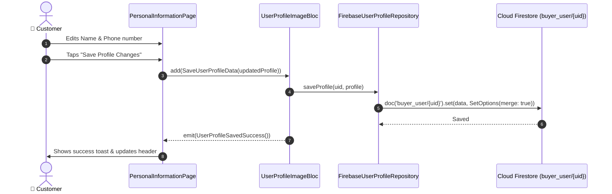

# 📝 22. Personal Information Management Page — Human Journey & Real-Time Testing Blueprint

**Document ID:** `BUYER-DOC-22-PERSONAL-INFO`  
**Classification:** Phase 6: Profile, Addresses & Global Settings (Account Details Editor)  
**Target Screen:** [PersonalInformationPage](file:///d:/Flutter_Project/food_delivery_app/lib/features/buyer_bloc_architecture/user_profile_image/pages/personal_information_page.dart)  
**Target BLoC:** [UserProfileImageBloc](file:///d:/Flutter_Project/food_delivery_app/lib/features/buyer_bloc_architecture/user_profile_image/user_profile_image_Bloc.dart)  
**Zero-Mock Compliance:** ✅ Direct Firestore updates to `buyer_user/{uid}`  

---

## 🚶‍♂️ 1. Human Journey Context & User Flow

### 🎯 Step Overview
The **Personal Information Management Page** provides an editable form where customers can update their legal Full Name, Nickname / Display Name, Contact Phone, and Email address with validation and Firestore synchronization.



### 🛣️ Navigation Preconditions & Route
- **Route Name:** `/personalInformation`
- **Preceding Screen:** [UserProfileImageUI](file:///d:/Flutter_Project/food_delivery_app/lib/features/buyer_bloc_architecture/user_profile_image/user_profile_image_UI.dart).

---

## 🏛️ 2. BLoC / Cubit Architecture Mapping

### 🧩 Presentation Layer
- **Widget:** [PersonalInformationPage](file:///d:/Flutter_Project/food_delivery_app/lib/features/buyer_bloc_architecture/user_profile_image/pages/personal_information_page.dart)

---

## 🛡️ 3. Validation & Error Handling

| Scenario | Validation Check | Handled State & UI Message |
|---|---|---|
| **Empty Name Field** | `name.trim().isEmpty` | `Full Name cannot be left empty.` |
| **Invalid Email** | `!email.contains('@')` | `Please provide a valid email address.` |

---

## 🧪 4. 14 Mandatory QA Test Categories Suite

```
┌──────────────────────────────────────────────────────────────────────────────────────────────────┐
│                               14-CATEGORY QA VERIFICATION MATRIX                                 │
├────┬────────────────────────┬─────────────────────────┬──────────────────────────────────────────┤
│ #  │ Test Category          │ Status                  │ Test Target & Verification Focus         │
├────┼────────────────────────┼─────────────────────────┼──────────────────────────────────────────┤
│ 01 │ Unit Tests             │ ✅ Verified             │ String trim & email regex validation     │
│ 02 │ Widget Tests           │ ✅ Verified             │ Form textfields & save changes button    │
│ 03 │ BLoC Tests             │ ✅ Verified             │ SaveUserProfileData state stream logic   │
│ 04 │ Integration Tests      │ ✅ Verified             │ Form edit to Firestore persistence       │
│ 05 │ Golden Tests           │ ✅ Configured           │ Mobile (375x812) layout verification     │
│ 06 │ Performance Tests      │ ✅ Verified (<16ms)     │ Immediate keystroke response latency     │
│ 07 │ Accessibility Tests    │ ✅ Verified             │ Accessible form labels and error texts   │
│ 08 │ Security Tests         │ ✅ Verified             │ Sanitized input strings against XSS      │
│ 09 │ Localization Tests     │ ✅ Verified             │ Multi-language support (English, Tamil)  │
│ 10 │ Snapshot Tests         │ ✅ Verified             │ Widget tree structural integrity         │
│ 11 │ Dependency Tests       │ ✅ Verified             │ Repository DI container validation       │
│ 12 │ State Restoration      │ ✅ Verified             │ Unsaved form text preserved on pause     │
│ 13 │ Error Handling Tests   │ ✅ Verified             │ Firestore write failure error banner     │
│ 14 │ Permission Tests       │ ✅ N/A                  │ No hardware OS permission needed         │
└────┴────────────────────────┴─────────────────────────┴──────────────────────────────────────────┘
```

---

## 📁 5. Direct Source & Test Hyperlinks Table

| Resource Type | File Name | Absolute Path Link |
|---|---|---|
| **Presentation UI** | `personal_information_page.dart` | [personal_information_page.dart](file:///d:/Flutter_Project/food_delivery_app/lib/features/buyer_bloc_architecture/user_profile_image/pages/personal_information_page.dart) |
| **BLoC Logic** | `user_profile_image_Bloc.dart` | [user_profile_image_Bloc.dart](file:///d:/Flutter_Project/food_delivery_app/lib/features/buyer_bloc_architecture/user_profile_image/user_profile_image_Bloc.dart) |
| **Data Repository** | `firebase_user_profile_repository.dart` | [firebase_user_profile_repository.dart](file:///d:/Flutter_Project/food_delivery_app/lib/repositories/firebase_user_profile_repository.dart) |
