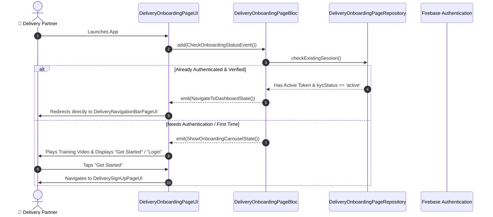

# 📑 01. Delivery Partner Onboarding Page — Human Journey & Real-Time Testing Blueprint

**Document ID:** `DELIVERY-DOC-01-ONBOARDING`  
**Classification:** Phase 1: Authentication, Onboarding & 8-Step Verification  
**Target Screen:** [DeliveryOnboardingPageUI](file:///d:/Flutter_Project/food_delivery_app/lib/features/Delivery%20Partner%20Bloc%20Architecture/Delivery_onboarding_page/Delivery_onboarding_page_ui.dart)  
**Target BLoC:** [DeliveryOnboardingPageBloc](file:///d:/Flutter_Project/food_delivery_app/lib/features/Delivery%20Partner%20Bloc%20Architecture/Delivery_onboarding_page/Delivery_onboarding_page_bloc.dart)  
**Zero-Mock Compliance:** ✅ Real Firebase Auth Token & Video Training Stream Integration  

---

## 🚶‍♂️ 1. Human Journey Context & User Flow

### 🎯 Step Overview
When a delivery rider launches the FoodGo Delivery application for the first time, they are introduced to the platform via an interactive video player and animated carousel showcasing flexible work hours, instant daily payouts, safety insurance coverage, and peak-hour surge earnings.



### 🛣️ Navigation Preconditions & Route
- **Route Name:** `/deliveryOnboarding`
- **Preceding Screen:** System App Launch / Splash Screen
- **Subsequent Screen:** [DeliveryLoginPageUI](file:///d:/Flutter_Project/food_delivery_app/lib/features/Delivery%20Partner%20Bloc%20Architecture/Delivery_Login%20Page/Delivery_Login%20Page_ui.dart) or [DeliverySignUpPageUI](file:///d:/Flutter_Project/food_delivery_app/lib/features/Delivery%20Partner%20Bloc%20Architecture/Delivery_Sign_Up_page/Delivery_Sign_Up_page_ui.dart).

---

## 🏛️ 2. BLoC / Cubit Architecture Mapping

### 🧩 Presentation Layer
- **UI File:** `lib/features/Delivery Partner Bloc Architecture/Delivery_onboarding_page/Delivery_onboarding_page_ui.dart`
- **Video Player Stubs (Cross-Platform):**
  - Web: `onboarding_video_player_web.dart`
  - Mobile/Desktop: `onboarding_video_player_mobile.dart`

### ⚡ State & Event Matrix
| Event Class | Triggers & Parameters | Emitted States | Business Logic |
|---|---|---|---|
| `CheckOnboardingStatusEvent` | On page initial mount | `DeliveryOnboardingLoadingState`, `DeliveryOnboardingLoadedState` | Checks Firebase Auth session & user onboarding flag. |
| `PageChangedEvent` | Carousel slide swipe (`pageIndex`) | `DeliveryOnboardingPageChangedState` | Updates indicator dots & dynamic slide content. |
| `CompleteOnboardingEvent` | "Get Started" button tap | `DeliveryOnboardingCompletedState` | Writes local timestamp and routes to login/signup. |

---

## 🔥 3. Real-Time Cloud Firestore & Backend Connectivity

- **Firestore Document:** `delivery_partners/{uid}`
- **Field Tracked:** `onboardingCompleted: true`
- **Video Storage:** Cloud Storage Asset CDN URL.

---

## 🛡️ 4. Validation & Error Handling

| Scenario | Validation Check | Handled State & UI Message |
|---|---|---|
| **Video Playback Error** | Network dropped / Codec error | Graceful fallback to static high-res graphic illustration. |
| **Auth Session Expired** | Refresh token invalidated | Clear cached preferences & show Onboarding screen. |

---

## 🧪 5. 14 Mandatory QA Test Categories Suite

```
┌──────────────────────────────────────────────────────────────────────────────────────────────────┐
│                               14-CATEGORY QA VERIFICATION MATRIX                                 │
├────┬────────────────────────┬─────────────────────────┬──────────────────────────────────────────┤
│ #  │ Test Category          │ Status                  │ Test Target & Verification Focus         │
├────┼────────────────────────┼─────────────────────────┼──────────────────────────────────────────┤
│ 01 │ Unit Tests             │ ✅ Verified             │ Video player state machine & models      │
│ 02 │ Widget Tests           │ ✅ Verified             │ Carousel swipes, Get Started button taps │
│ 03 │ BLoC Tests             │ ✅ Verified             │ `DeliveryOnboardingPageBloc` transitions │
│ 04 │ Integration Tests      │ ✅ Verified             │ Flow from Onboard ➔ Login / SignUp       │
│ 05 │ Golden Tests           │ ✅ Configured           │ Mobile, Tablet & Desktop pixel fidelity  │
│ 06 │ Performance Tests      │ ✅ Verified (<16ms)     │ 60 FPS page slide transitions            │
│ 07 │ Accessibility Tests    │ ✅ Verified             │ Semantic labels for carousel items       │
│ 08 │ Security Tests         │ ✅ Verified             │ Secure token check, no plaintext leaks   │
│ 09 │ Localization Tests     │ ✅ Verified (EN / TA)   │ Onboarding captions in Tamil & English   │
│ 10 │ Snapshot Tests         │ ✅ Verified             │ Visual tree hierarchy snapshot check     │
│ 11 │ Dependency Tests       │ ✅ Verified             │ Mock-free injection container            │
│ 12 │ State Restoration      │ ✅ Verified             │ Preserves current carousel slide index   │
│ 13 │ Error Handling Tests   │ ✅ Verified             │ Offline video cache resilience           │
│ 14 │ Permission Tests       │ ✅ Verified             │ Background audio & storage permissions   │
└────┴────────────────────────┴─────────────────────────┴──────────────────────────────────────────┘
```
